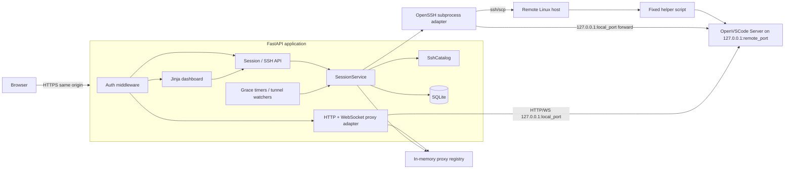
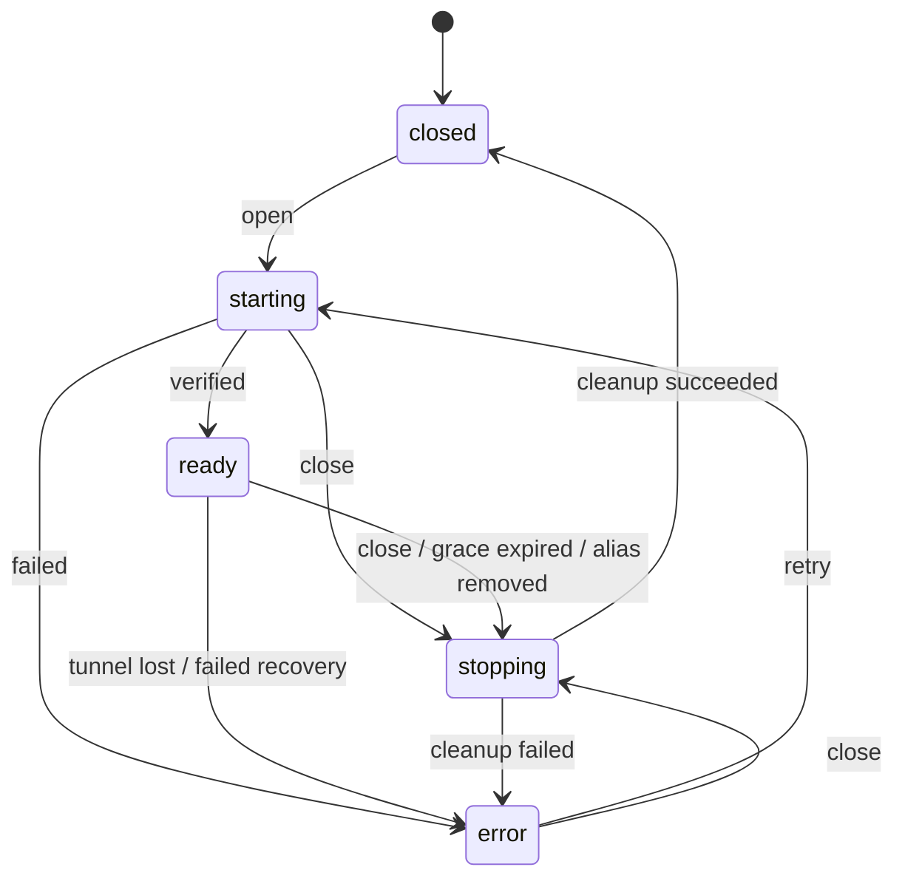

# OpenVSCode SSH Gateway

**Status:** Implementation audit — corrective hardening required before production  
**Target:** A production-ready, single-process Python service that preserves the implemented architecture and closes the audited security, lifecycle, recovery, and test gaps  
**Primary architectural decision:** The dashboard, control API, and proxied OpenVSCode editor share one authenticated origin and one application domain  
**Compatibility policy:** Preserve user-visible capabilities and operational safety, not the earlier TypeScript module boundaries, private APIs, database schema, or dual-origin security model

---

> [!IMPORTANT]
> **2026-07-20 implementation audit:** The Python architecture described below is already present in the repository, but the current implementation is not production-ready. The corrective requirements in this revision—especially authenticated WebSockets, safe Retry, candidate SSH-config validation, resource-owned capacity, cancellation-safe lifecycle handling, real readiness, and executable integration tests—take precedence over older illustrative pseudocode where they differ.

## 1. Executive summary

Complete and harden the existing compact Python application so that it:

1. Discovers workspaces from positive, literal `Host` aliases in a dedicated OpenSSH configuration.
2. Uses the system `ssh`, `scp`, and `ssh-keygen` executables so OpenSSH remains responsible for `HostName`, `User`, `IdentityFile`, `ProxyJump`, host-key checking, agents, and other SSH behavior.
3. Starts a pinned OpenVSCode Server release on the selected remote host, bound to remote loopback and opened without a project folder.
4. Creates a loopback-only SSH local forward from the gateway host to the remote OpenVSCode process.
5. Proxies OpenVSCode HTTP and WebSocket traffic under the same origin as the dashboard.
6. Tracks one current session per SSH alias.
7. Closes a session explicitly or after the final browser connection remains absent for a configurable grace period.
8. Persists only the operational data needed to inspect, recover, or clean up live sessions after a gateway restart.
9. Keeps SSH configuration editing and SSH key management, but implements them through small, explicit services.
10. Uses mature Python libraries for HTTP, WebSocket, settings, templates, password hashing, validation, and SQLite access instead of reproducing those facilities.

The implemented architecture intentionally removes:

- Separate control and editor origins.
- Editor grants and one-time handoff tokens.
- A second editor-authentication subsystem.
- OpenVSCode connection-token generation, encryption, storage, URL rewriting, and cookie rewriting.
- A generic internal event bus.
- Generic per-session command queues.
- The large desired-state/observed-state/retry state machine.
- Persistent local-port leases.
- Multiple repositories for tiny tables.
- A broad hexagonal architecture with an interface for every internal dependency.
- Automatic retry orchestration beyond a few bounded, local retries around known transient operations.

The service should remain understandable by reading roughly ten Python modules and one remote helper script. Corrective work must not reintroduce the orchestration layers intentionally removed by this architecture.

---

## 2. Source-system assessment

The repository now implements the planned Python/FastAPI architecture rather than the earlier TypeScript source system. The current baseline includes:

- one FastAPI application and one public origin;
- a signed browser session and CSRF mechanism;
- SSH alias discovery from a dedicated OpenSSH config;
- SQLite session persistence;
- a `SessionService` with per-alias locks and background lifecycle tasks;
- system `ssh`, `scp`, and `ssh-keygen` subprocesses;
- a remote helper and pinned OpenVSCode artifact workflow;
- loopback-only OpenVSCode and SSH forwarding;
- an HTTP/WebSocket editor proxy under `/editor/{session_id}/`;
- dashboard, SSH-config, and key-management routes;
- unit and integration test directories.

### 2.1 Audit result

The architecture is directionally conformant, but the implementation has production-blocking deviations:

- the editor WebSocket route is not authenticated and does not validate exact Origin or `ready` state;
- `SessionService.retry()` recursively acquires the same non-reentrant alias lock and can deadlock;
- SSH config save validates the live file rather than the candidate file and does not reject failed validation;
- capacity is an anonymous in-memory counter that leaks on some failures and is not rebuilt for recovered sessions;
- startup cancellation and unexpected exceptions do not guarantee resource cleanup and durable error state;
- close can act on a stale startup snapshot and miss a newly created remote process;
- readiness is unconditional even when recovery fails;
- cookie/session behavior is inconsistent with the middleware-only design, and generation/throttling are not fully enforced;
- the HTTP proxy buffers request and response bodies rather than streaming;
- subprocess output is truncated only after unbounded buffering;
- artifact download/cache operations need size and concurrency bounds;
- core integration tests are placeholders and do not prove the definition of done.

### 2.2 Corrective design constraint

Corrective work must preserve the existing simplification decisions:

- keep one authenticated origin;
- keep one ASGI process and enforce it with an operating-system singleton lock;
- keep SQLite, system OpenSSH, one `SessionService`, and the small remote helper;
- do not add Redis, a generic job queue, a second editor-authentication system, or distributed coordination;
- solve lifecycle correctness through explicit resource ownership, idempotent cleanup, durable state transitions, and tests.

### 2.3 Review scope

The 2026-07-20 review was static because the repository could not be cloned or executed in the review environment. Before release, all findings must be verified from a pinned commit by running formatting, type checking, unit, integration, helper, browser, security, load, and restart tests.

## 3. Goals

### 3.1 Functional goals

The first production-ready Python release must provide:

- Single-user password login and logout.
- Same-origin dashboard and editor access.
- SSH alias discovery from one dedicated SSH config file.
- Dashboard status for every discovered alias.
- Open, close, reopen, and retry actions.
- One active session per alias.
- A configurable maximum number of concurrent sessions.
- Remote capability checks for supported Linux architecture and required tools.
- Pinned OpenVSCode artifact download and SHA-256 verification.
- Idempotent remote runtime installation.
- Folderless OpenVSCode startup.
- Remote loopback binding.
- Local loopback SSH forwarding.
- Reverse proxying for OpenVSCode HTTP requests and WebSockets.
- Browser presence tracking based primarily on editor WebSocket connections.
- Disconnect grace-period cleanup.
- Explicit close even when the alias has been removed from the SSH config, provided a live session still exists.
- Startup recovery and orphan cleanup.
- SSH config read, validate, atomically replace, and reload.
- SSH public-key listing and Ed25519 key generation.
- Health and readiness endpoints.
- Structured logs with secret redaction.
- Unit, integration, and browser end-to-end tests.

### 3.2 Simplicity goals

The implementation should continue to optimize for:

- One application process.
- One public origin.
- One SQLite file.
- One active-session table.
- One main session service.
- No Redis, Celery, message broker, or distributed locks.
- No ORM unless the schema grows materially.
- No custom dependency-injection container.
- No internal event-bus abstraction.
- No automatic background worker separate from the web app.
- No compatibility layer for the current private TypeScript APIs.
- No persistence of data that can be derived from SSH config or remote inspection.
- No generic framework abstractions until a second concrete implementation exists.

### 3.3 Operational goals

- A gateway restart must not silently leak unmanaged remote OpenVSCode processes.
- A failed start must run best-effort cleanup.
- A failed stop must remain visible and retryable.
- Every subprocess call must have an explicit timeout and bounded output capture.
- Dynamic values must be passed as process arguments, never interpolated into shell command strings.
- Local and remote state directories must be private.
- The service must refuse unsafe startup configuration rather than silently weaken protections.

---

## 4. Non-goals

The production baseline will not initially provide:

- Multiple gateway users, organizations, teams, roles, or per-workspace ACLs.
- Multi-instance active/active deployment.
- Horizontal scaling.
- Kubernetes orchestration.
- Workspace CRUD separate from SSH aliases.
- A project-path picker before OpenVSCode starts.
- Remote file browsing in the dashboard.
- Arbitrary remote command execution.
- Arbitrary environment-variable injection into OpenVSCode.
- General-purpose SSH config parsing or normalization.
- Full support for every OpenSSH directive in the config editor.
- Full backward compatibility with the TypeScript database.
- Migration of current editor grants, encrypted secrets, or local-port leases.
- Reproduction of the dual-origin control/editor isolation.
- Reimplementation of SSH in Python.
- A bespoke reverse-proxy framework.
- Transparent reuse of an old session after an explicit Close; reopening always creates a fresh run.
- Guaranteed preservation of an editor session through every gateway crash. Recovery is best effort and safety-biased.

---

## 5. Architectural decisions

### ADR-001: Use one authenticated origin

Expose all browser surfaces from a single origin:

```text
https://gateway.example/
├── /login
├── /logout
├── /                         dashboard
├── /settings/ssh             SSH config page
├── /settings/keys            SSH keys page
├── /api/...                  JSON control API
└── /editor/{session_id}/...  proxied OpenVSCode HTTP and WebSocket traffic
```

Consequences:

- One signed session cookie authenticates both dashboard and editor proxy requests.
- No editor grants or handoff tokens are needed.
- OpenVSCode is started with `--without-connection-token`.
- The proxy does not inject or rewrite an OpenVSCode token.
- CSRF protection remains required for all gateway mutation routes.
- OpenVSCode JavaScript has same-origin access to gateway routes. This is accepted because the rewrite explicitly trusts the pinned OpenVSCode code and installed extensions sufficiently to share the origin.
- The deployment documentation must state that this is a weaker isolation boundary than a separate editor origin.

### ADR-002: Keep system OpenSSH as the SSH implementation

Invoke system binaries through `asyncio.create_subprocess_exec`:

- `ssh`
- `scp`
- `ssh-keygen`

Do not use a Python SSH protocol implementation as the primary transport.

Rationale:

- The core product promise is that normal OpenSSH `Host`, `IdentityFile`, `ProxyJump`, agent, certificate, host-key, and known-hosts behavior continues to work.
- Reproducing OpenSSH configuration semantics in Python would increase code and compatibility risk.
- AsyncSSH is capable and includes forwarding APIs, but adopting it would move configuration and compatibility responsibility into the application.
- Python still provides the orchestration and timeout model; OpenSSH remains the compatibility boundary.

Every invocation must include the dedicated config explicitly:

```text
ssh -F /path/to/gateway_ssh_config ...
scp -F /path/to/gateway_ssh_config ...
```

No command may use `shell=True`.

### ADR-003: Model one current session per alias

The persistent model is a `Session` keyed uniquely by SSH alias. A session has a private random identifier used in the editor URL and remote state directory.

The dashboard does not maintain a separate workspace domain object. It creates a projection by merging:

1. aliases currently discovered from SSH config; and
2. persisted live/error sessions, including sessions whose alias was removed while they were running.

This keeps “session” and “dashboard workspace” in one domain.

### ADR-004: Use five externally meaningful states

Use only:

```text
starting
ready
stopping
error
closed   (implicit when no active row exists)
```

Do not persist separate desired and observed states.

A `stage` field provides diagnostic precision without becoming another state machine:

```text
validate
install
start_remote
start_tunnel
verify
recover
stop
```

This removes `queued`, `validating`, `deploying`, `starting-runtime`, `starting-tunnel`, `verifying`, `degraded`, `retry-wait`, `failed`, and independent desired-state logic.

### ADR-005: Use direct service calls and per-alias locks

The session service exposes:

```python
async def open(alias: str) -> SessionView
async def close(alias: str, reason: CloseReason) -> None
async def retry(alias: str) -> SessionView
async def recover_all() -> RecoveryReport
async def reconcile_catalog() -> None
```

Concurrency is controlled by:

- one `asyncio.Lock` per alias;
- one global `asyncio.Semaphore` for session capacity;
- one application-lifespan task group for grace timers and tunnel watchers.

No generic command queue or event bus is required.

### ADR-006: Use SQLite directly through `aiosqlite`

Use explicit SQL and typed row mapping.

Do not introduce SQLAlchemy or another ORM for one operational table. Add an ORM only when the schema or query graph becomes complex enough to justify it.

Schema migrations use numbered SQL files plus `PRAGMA user_version`. This is sufficient for a single-process application with a small schema and avoids Alembic machinery.

### ADR-007: Keep a fixed remote helper, but shrink it

Retain a versioned POSIX shell helper because process management, `/proc` identity checks, safe extraction, and process-group signaling are most reliable on the remote Linux host.

Reduce its interface to fixed operations:

```text
capabilities
runtime-inspect
runtime-install
session-start
session-inspect
session-stop
session-remove
session-list
```

The helper must:

- whitelist operation names;
- validate every argument;
- never evaluate decoded data;
- emit one JSON object;
- use private directories;
- verify runtime archive digest before extraction;
- reject unsafe archive entries;
- persist PID, boot ID, process start ID, executable path, and bound port;
- signal the process group only after identity validation;
- never run arbitrary user-provided commands.

The existing helper is a good behavioral reference, but the Python rewrite may use a cleaner argument protocol and smaller implementation.

### ADR-008: Use a thin library-based proxy

Use:

- `httpx.AsyncClient` for streaming HTTP upstream requests and responses;
- `websockets` for the upstream WebSocket client;
- FastAPI/Starlette for downstream HTTP and WebSocket handling.

Application-owned proxy code should be restricted to:

- route lookup;
- gateway authentication;
- upstream URL construction;
- removal of hop-by-hop headers;
- removal of the gateway session cookie before forwarding;
- forwarding of safe request and response headers;
- bidirectional WebSocket frame relay;
- connection accounting;
- deterministic timeout and error mapping.

Do not implement HTTP parsing, WebSocket framing, compression, ping/pong framing, or TLS.

---

## 6. Proposed runtime architecture



### 6.1 Process model

Run one ASGI process with one worker:

```text
uvicorn vscode_gateway.app:create_app --factory --workers 1
```

A single worker is an architectural constraint because alias locks, capacity ownership, tunnel handles, proxy targets, WebSocket counts, grace timers, and lifecycle tasks are process-local.

Documentation and the Uvicorn command are not sufficient enforcement. At startup, before opening the mutable database or launching recovery, the application must:

1. create/open a lock file inside the private state directory;
2. acquire an exclusive non-blocking operating-system file lock;
3. hold the descriptor and lock for the complete process lifetime;
4. fail startup with an actionable error when the lock is already held;
5. release it only during final process teardown.

This rejects both accidental multi-worker Uvicorn deployments and a second service instance sharing the same state directory. A test must start two application processes against one state directory and prove that exactly one reaches readiness.

If future multi-process deployment is required, it is a separate design requiring external coordination for locks, capacity, tunnels, registry state, presence, and timers.

### 6.2 Reverse proxy and TLS

Terminate TLS in a standard front proxy such as Caddy, nginx, or a platform ingress. Forward one origin to Uvicorn.

Required proxy behavior:

- preserve `Host`;
- set `X-Forwarded-Proto`;
- support WebSocket upgrades;
- set a generous read timeout for editor WebSockets;
- limit request-body size on gateway API routes;
- avoid response buffering for proxied editor streams where possible.

FastAPI should trust forwarded headers only from configured proxy IPs.

---

## 7. Python technology selection

| Concern | Choice | Reason |
|---|---|---|
| Language | Python 3.13+; production baseline may be 3.14 | Modern typing, `asyncio`, `TaskGroup`, and maintained runtime |
| Packaging | `uv` with `pyproject.toml` | Fast, deterministic dependency and environment management |
| Web framework | FastAPI + Starlette | Typed APIs, middleware, templates, lifespan, HTTP and WebSocket routes |
| ASGI server | Uvicorn | Standard FastAPI deployment path |
| Settings | `pydantic-settings` | Environment/file validation and clear startup failures |
| HTML | Jinja2 | Server-rendered dashboard with minimal browser code |
| Browser updates | Small vanilla JavaScript polling | Avoid a frontend build pipeline |
| Authentication | Starlette `SessionMiddleware` | Signed cookie sessions; no custom cookie format |
| Password hashing | `pwdlib[argon2]` | Modern password-hash verification |
| Data validation | Pydantic models | API and configuration validation |
| SQLite access | `aiosqlite` | Small asynchronous adapter without ORM overhead |
| HTTP client/proxy | HTTPX | Async streaming and connection pooling |
| WebSocket upstream | `websockets` | Correct protocol implementation and async client |
| SSH transport | System OpenSSH via `asyncio.create_subprocess_exec` | Preserve OpenSSH behavior |
| Retry helper | `tenacity`, only for bounded local retries | Avoid custom retry loops where retry is actually justified |
| IDs | Standard `uuid.uuid4()` or `uuid.uuid7()` when baseline supports it | No need for a separate ULID package |
| Logging | Standard `logging` plus `structlog` JSON rendering | Structured events with context binding |
| Tests | pytest + AnyIO plugin + HTTPX ASGI transport | Async unit/integration testing |
| Browser tests | Playwright for Python | End-to-end editor and dashboard flows |
| Lint/format | Ruff | One fast tool for formatting and linting |
| Type checking | Pyright or mypy in strict mode | Enforce service contracts |
| Security scan | Bandit and `pip-audit`/`uv audit` | Static checks and dependency advisories |

### 7.1 Deliberate library rejections

#### Do not use AsyncSSH as the default transport

AsyncSSH is a capable library, including local forwarding. It is not selected because the dedicated OpenSSH config is a product-level source of truth and compatibility surface. A later optional transport can be considered only if it passes a test suite covering the OpenSSH features users depend on.

#### Do not use SQLAlchemy initially

The operational schema is intentionally small. SQLAlchemy would add model, session, engine, and migration concepts without reducing enough code. Direct SQL also makes concurrency and transaction boundaries obvious.

#### Do not use Celery, RQ, Dramatiq, or Redis

Session start and stop are local orchestration jobs owned by a single process. A distributed job system would create more failure modes than it solves.

#### Do not use a SPA framework

The dashboard is a list of aliases with status and a few forms. Server-rendered Jinja templates and small polling code are sufficient.

---

## 8. Repository layout

```text
vscode-gateway-python/
├── pyproject.toml
├── uv.lock
├── README.md
├── LICENSE
├── src/
│   └── vscode_gateway/
│       ├── __init__.py
│       ├── app.py
│       ├── settings.py
│       ├── models.py
│       ├── errors.py
│       ├── db.py
│       ├── auth.py
│       ├── ssh.py
│       ├── runtime.py
│       ├── sessions.py
│       ├── proxy.py
│       ├── routes.py
│       ├── remote/
│       │   └── gateway-helper-v1.sh
│       ├── migrations/
│       │   └── 001_initial.sql
│       ├── templates/
│       │   ├── base.html
│       │   ├── login.html
│       │   ├── dashboard.html
│       │   ├── ssh_config.html
│       │   └── keys.html
│       └── static/
│           ├── app.css
│           └── dashboard.js
├── tests/
│   ├── unit/
│   │   ├── test_auth.py
│   │   ├── test_catalog.py
│   │   ├── test_db.py
│   │   ├── test_sessions.py
│   │   └── test_proxy_headers.py
│   ├── integration/
│   │   ├── fakes/
│   │   │   ├── ssh
│   │   │   ├── scp
│   │   │   └── ssh-keygen
│   │   ├── test_open_close.py
│   │   ├── test_recovery.py
│   │   └── test_proxy.py
│   └── e2e/
│       ├── compose.yaml
│       ├── test_dashboard.py
│       └── test_editor.py
├── scripts/
│   ├── create-password-hash.py
│   └── verify-release.py
└── deploy/
    ├── vscode-gateway.service
    └── Caddyfile.example
```

### 8.1 Module responsibilities

#### `app.py`

- Create settings.
- Validate filesystem and process prerequisites.
- Initialize logging.
- Open database.
- Create shared HTTP client.
- Build services.
- Run migrations.
- Run startup recovery.
- Start the lifespan task group.
- Register routes and middleware.
- Close sessions, subprocesses, clients, and database on graceful shutdown.

#### `settings.py`

One Pydantic settings model. It must validate:

- canonical public origin;
- bind host and port;
- state/runtime paths;
- SSH config and keys paths;
- password hash path;
- session secret path;
- OpenSSH executable paths;
- OpenVSCode version, download URLs, and SHA-256 values by platform;
- session capacity;
- startup/stop/proxy timeouts;
- disconnect grace period;
- trusted proxy networks;
- allowed hostnames.

No service should read environment variables directly.

#### `models.py`

Contain only shared typed data:

- `SessionState`
- `SessionStage`
- `CloseReason`
- `SessionRecord`
- `SessionView`
- `WorkspaceView`
- `SshAlias`
- `RuntimeIdentity`
- `TunnelIdentity`
- request and response Pydantic models

Avoid dozens of tiny nominal ID wrappers unless they prevent a real class of bug.

#### `errors.py`

Define one application exception family and a small error-code enum.

#### `db.py`

- Database opening and PRAGMAs.
- Migration runner.
- Session CRUD.
- Transactions.
- Row-to-dataclass mapping.
- No generic repository abstraction.

#### `auth.py`

- Login/logout.
- Session cookie helpers.
- CSRF generation and verification.
- Password hash loading and verification.
- Login throttling.
- Route dependencies for authenticated HTTP and WebSocket requests.

#### `ssh.py`

- SSH alias catalog.
- SSH config revision/hash.
- OpenSSH invocation.
- `scp` transfer.
- Local-forward process creation.
- Key listing and generation.
- Subprocess timeout/output helpers.
- No remote runtime semantics.

#### `runtime.py`

- Artifact cache and SHA-256 verification.
- Remote helper installation.
- Runtime capability inspection.
- Remote runtime installation.
- Session start/inspect/stop/remove.
- Parse and validate helper JSON responses.

#### `sessions.py`

- Open, close, retry, recovery, catalog reconciliation.
- Per-alias locks.
- Capacity semaphore.
- Proxy target registry updates.
- Browser presence accounting.
- Grace timers.
- Tunnel-exit watchers.
- Conversion to dashboard/API views.

#### `proxy.py`

- HTTP proxy route.
- WebSocket proxy route.
- Header filtering.
- Cookie removal.
- Connection lifecycle callback into `SessionService`.

#### `routes.py`

- Dashboard HTML routes.
- JSON API routes.
- SSH configuration routes.
- Key routes.
- Health/readiness routes.
- Exception-to-problem-response mapping.

---

## 9. Unified domain model

### 9.1 Identity

```python
SshAlias = str
SessionId = UUID
```

Rules:

- The SSH alias is the stable workspace identity.
- The session ID is private operational identity.
- A new session ID is generated whenever a closed alias is reopened.
- Session IDs appear in editor paths so stale editor URLs cannot attach to a later run for the same alias.
- The API primarily addresses actions by alias because that is what the user understands.
- Proxy requests address a specific session ID and are rejected if that ID is not currently `ready`.

### 9.2 Workspace projection

A workspace is not persisted. It is rendered from:

```python
@dataclass(frozen=True)
class WorkspaceView:
    alias: str
    state: Literal["closed", "starting", "ready", "stopping", "error"]
    session_id: UUID | None
    editor_url: str | None
    connected_clients: int
    disconnect_deadline: datetime | None
    stage: str | None
    error_code: str | None
    error_message: str | None
    can_open: bool
    can_close: bool
    can_retry: bool
```

Projection rules:

- Config alias with no session row → `closed`.
- Session row with alias still in config → show current state.
- Session row whose alias was removed → continue showing it until stopped, with `catalog_missing=true`.
- `editor_url` exists only in `ready`.
- `can_open` is true only in `closed`.
- `can_close` is true in `starting`, `ready`, `stopping`, and `error` when cleanup resources may exist.
- `can_retry` is true in `error`.
- Dashboard ordering:
  1. `ready`
  2. `starting`
  3. `stopping`
  4. `error`
  5. `closed`
  6. alias lexicographically within each group

### 9.3 Persisted session

```python
@dataclass
class SessionRecord:
    id: UUID
    alias: str
    state: SessionState
    stage: SessionStage | None

    remote_pid: int | None
    remote_port: int | None
    remote_boot_id: str | None
    remote_process_start_id: str | None
    remote_executable: str | None

    local_port: int | None
    tunnel_pid: int | None

    connected_clients: int
    last_connected_at: datetime | None
    last_disconnected_at: datetime | None
    disconnect_deadline_at: datetime | None

    error_code: str | None
    error_message: str | None
    close_reason: str | None

    created_at: datetime
    updated_at: datetime
```

Do not persist:

- editor tokens;
- editor grants;
- control tokens;
- HTTP proxy socket objects;
- asyncio tasks;
- locks;
- password material;
- SSH private-key contents;
- full SSH command output;
- derived editor URLs.

### 9.4 State transitions



Transition rules:

- `closed` is represented by the absence of a session row.
- Only one row may exist for an alias.
- Only the session service writes state.
- Open is idempotent:
  - `starting` or `ready` returns the existing view.
  - `stopping` returns conflict.
  - `error` returns conflict with a Retry instruction.
- Close is idempotent:
  - no row returns success;
  - `stopping` returns accepted;
  - any other row begins or continues cleanup.
- Retry first performs cleanup for the errored record, then starts a fresh session ID.
- A start failure must preserve enough information to retry cleanup.
- A successful stop deletes the row.

### 9.5 Error codes

Keep the stable set small:

```text
alias_not_found
capacity_reached
ssh_unreachable
ssh_config_invalid
remote_unsupported
runtime_download_failed
runtime_digest_mismatch
runtime_install_failed
remote_start_failed
remote_identity_conflict
tunnel_start_failed
tunnel_lost
editor_unhealthy
startup_timeout
stop_failed
recovery_failed
internal_error
```

`stage` and a safe operator message provide detail. Full stderr belongs only in redacted structured logs, with bounded length.

---

## 10. SQLite design

### 10.1 Initial schema

```sql
PRAGMA foreign_keys = ON;

CREATE TABLE sessions (
    id TEXT PRIMARY KEY,
    alias TEXT NOT NULL UNIQUE,

    state TEXT NOT NULL
        CHECK (state IN ('starting', 'ready', 'stopping', 'error')),
    stage TEXT
        CHECK (
            stage IS NULL OR
            stage IN (
                'validate',
                'install',
                'start_remote',
                'start_tunnel',
                'verify',
                'recover',
                'stop'
            )
        ),

    remote_pid INTEGER,
    remote_port INTEGER,
    remote_boot_id TEXT,
    remote_process_start_id TEXT,
    remote_executable TEXT,

    local_port INTEGER,
    tunnel_pid INTEGER,

    connected_clients INTEGER NOT NULL DEFAULT 0
        CHECK (connected_clients >= 0),
    last_connected_at TEXT,
    last_disconnected_at TEXT,
    disconnect_deadline_at TEXT,

    error_code TEXT,
    error_message TEXT,
    close_reason TEXT,

    created_at TEXT NOT NULL,
    updated_at TEXT NOT NULL
);

CREATE INDEX sessions_state_idx ON sessions(state);
CREATE INDEX sessions_disconnect_deadline_idx
    ON sessions(disconnect_deadline_at)
    WHERE disconnect_deadline_at IS NOT NULL;

PRAGMA user_version = 1;
```

### 10.2 Database configuration

On open:

```sql
PRAGMA journal_mode = WAL;
PRAGMA synchronous = NORMAL;
PRAGMA foreign_keys = ON;
PRAGMA busy_timeout = 5000;
```

Use one long-lived application connection or a very small explicit connection strategy. SQLite has one writer; the application already serializes per-alias operations, so a pool is unnecessary.

### 10.3 Transaction rules

- State changes and resource identity updates happen in one transaction.
- Never hold a SQLite transaction open while awaiting SSH, network, or subprocess work.
- Pattern:
  1. lock alias;
  2. persist intention/state;
  3. perform external operation;
  4. persist observation/result.
- Every update uses `updated_at`.
- Use compare-and-set where stale task completion is possible:
  `UPDATE ... WHERE id = ? AND state = ?`.
- Startup recovery runs before readiness becomes true.

### 10.4 Migration policy

- Migrations are append-only numbered SQL files.
- The runner reads `PRAGMA user_version`.
- Each migration runs in an exclusive transaction.
- Database files newer than the binary understands cause startup failure.
- Back up the SQLite file before a destructive future migration.
- The initial cutover does not migrate the TypeScript operational database; it starts a new database after old sessions are closed.

---

## 11. SSH alias catalog

### 11.1 Discovery behavior

The dedicated SSH config is the source of truth.

Discover aliases by scanning `Host` lines and retaining tokens that are:

- positive;
- literal;
- not `*`;
- not prefixed by `!`;
- free of wildcard characters `*`, `?`, and `[...]`;
- valid UTF-8;
- within a conservative length limit;
- safe to pass as a single subprocess argument.

For each candidate alias, run:

```text
ssh -F <config> -G <alias>
```

The alias is considered valid only when OpenSSH successfully resolves it.

Do not build a complete SSH config parser. The scanner extracts candidate aliases; OpenSSH validates semantics.

### 11.2 Catalog caching

Maintain an immutable catalog snapshot:

```python
@dataclass(frozen=True)
class CatalogSnapshot:
    revision: str
    aliases: tuple[str, ...]
    loaded_at: datetime
    error: str | None
```

- `revision` is SHA-256 of config bytes.
- Refresh at startup, after a successful edit, and periodically at a low frequency.
- If refresh fails, retain the last valid snapshot and mark the catalog stale.
- Do not close sessions merely because the config is temporarily unreadable.
- Close a live session for a removed alias only after a successfully validated new snapshot proves the alias is absent.

### 11.3 Config editor

API behavior:

```text
GET /api/ssh/config
PUT /api/ssh/config
```

`GET` returns current text and a SHA-256 revision. `PUT` supplies candidate text and `expectedRevision`.

All writes are serialized through one process-wide config-write lock. The lock covers the revision recheck, candidate validation, atomic replacement, committed-file refresh, catalog publication, and removed-alias reconciliation.

Write algorithm:

1. Require an authenticated session and valid CSRF token.
2. Under the config-write lock, re-read the active file and reject when `expectedRevision` differs from its hash.
3. Enforce body byte-size, line-count, line-length, alias-count, and validation-time limits.
4. Reject NUL bytes, invalid UTF-8, unsafe file state, and prohibited directives.
5. Create a unique temporary file in the same directory using exclusive creation and mode `0600`; do not reuse a deterministic `.tmp` path.
6. Write the exact candidate bytes and flush them.
7. Discover candidate aliases from the temporary file.
8. For every candidate, run exactly `ssh -F <temporary-file> -G <alias>` through the bounded subprocess primitive.
9. Reject the operation on any nonzero exit, timeout, oversized output, malformed result, or policy error. Delete the temporary file and leave the active file/catalog unchanged.
10. `fsync` the temporary file.
11. Atomically replace the target with `os.replace`.
12. `fsync` the parent directory.
13. Re-read the committed target, compute its revision, and rebuild a valid catalog snapshot from that committed path.
14. Publish the snapshot only after committed-file validation succeeds.
15. Reconcile removed aliases only from the newly published valid snapshot.

If a post-replace refresh unexpectedly fails, do not publish candidate-derived state. Report a degraded catalog and preserve the last-known-good snapshot while surfacing an operator error. Tests must prove that invalid content never replaces active bytes and that validation argv references the candidate path.

### 11.4 Unsafe-directive policy

For a web-editable dedicated config, reject directives that expand the gateway into a command-execution or forwarding tool unless explicitly reviewed:

```text
Include
Match
ProxyCommand
LocalCommand
PermitLocalCommand
RemoteCommand
LocalForward
RemoteForward
DynamicForward
Tunnel
CanonicalizeHostname
KnownHostsCommand
PKCS11Provider
SecurityKeyProvider
```

`ProxyJump` remains allowed because it is a core use case and is executed by OpenSSH without a shell command.

This policy is intentionally conservative. It can be relaxed only with tests and threat-model updates.

---

## 12. SSH subprocess adapter

### 12.1 One safe subprocess primitive

Implement one helper:

```python
async def run_process(
    argv: Sequence[str],
    *,
    timeout: float,
    stdin: bytes | None = None,
    max_stdout: int = 1_000_000,
    max_stderr: int = 1_000_000,
    env: Mapping[str, str] | None = None,
) -> ProcessResult:
    ...
```

Requirements:

- use `asyncio.create_subprocess_exec` and never a shell;
- start a new local process group when cleanup requires it;
- enforce timeout and cancellation with TERM followed by KILL;
- read stdout and stderr concurrently to avoid pipe deadlock;
- enforce `max_stdout` and `max_stderr` while reading, not by slicing after `communicate()` has buffered everything;
- terminate the process group and return a distinct oversized-output error when either bound is exceeded;
- retain only a documented bounded diagnostic prefix/tail;
- preserve raw bytes for protocols and decode with replacement only for sanitized logs;
- log executable and redacted argument classes, not secrets;
- return exit code, bounded stdout/stderr, duration, timeout status, and oversized-output status;
- guarantee child reaping on timeout, cancellation, output overflow, and caller error.

Tests must include a child that writes indefinitely to stdout and stderr and prove bounded memory behavior and deterministic termination.

### 12.2 Connectivity probe

Use a fixed command:

```text
ssh
  -F <config>
  -o BatchMode=yes
  -o ConnectTimeout=<seconds>
  -o ServerAliveInterval=15
  -o ServerAliveCountMax=2
  --
  <alias>
  /bin/sh <remote-helper> capabilities
```

The exact remote command should remain a fixed helper invocation. Dynamic values are encoded as validated arguments.

### 12.3 Local tunnel process

Start:

```text
ssh
  -F <config>
  -N
  -T
  -o BatchMode=yes
  -o ExitOnForwardFailure=yes
  -o ServerAliveInterval=15
  -o ServerAliveCountMax=2
  -L 127.0.0.1:<local_port>:127.0.0.1:<remote_port>
  --
  <alias>
```

Store:

- child process object in memory;
- PID and local port in SQLite for diagnostics/recovery;
- watcher task that waits for process exit.

The watcher calls `SessionService.on_tunnel_exit(session_id, return_code)`. This direct callback replaces an event bus.

### 12.4 Local port allocation

Because only one gateway process is supported:

1. Ask the kernel for an ephemeral loopback port by binding a temporary socket to `127.0.0.1:0`.
2. Read the selected port.
3. Close the socket.
4. Immediately start OpenSSH with `ExitOnForwardFailure`.
5. If the port was raced, choose another port and retry a small bounded number of times.

No persistent port-lease table is needed. During recovery, create a new local forward and update the row.

---

## 13. OpenVSCode artifact and remote runtime

### 13.1 Artifact manifest

Configuration includes a manifest per supported platform:

```toml
[openvscode]
version = "x.y.z"

[openvscode.platforms.linux-x64]
url = "https://..."
sha256 = "..."

[openvscode.platforms.linux-arm64]
url = "https://..."
sha256 = "..."
```

Do not discover “latest” at runtime.

### 13.2 Local cache

Cache key:

```text
<version>/<platform>/<sha256>/openvscode-server.tar.gz
```

Download algorithm:

- acquire an in-process lock per digest;
- stream with HTTPX to a temporary file;
- enforce a maximum size;
- compute SHA-256 while streaming;
- reject mismatched digest;
- `fsync` and atomically rename;
- reuse only after rechecking expected size/digest metadata as configured.

### 13.3 Remote install

Flow:

1. Run helper `capabilities`.
2. Select manifest entry from reported architecture.
3. Run helper `runtime-inspect`.
4. If exact digest is installed, continue.
5. Copy archive with `scp` to a random private temporary path.
6. Invoke helper `runtime-install <path> <sha256> <version>`.
7. Helper verifies SHA-256 again on the remote host.
8. Helper safely extracts to a temporary directory under its managed root.
9. Helper verifies the OpenVSCode executable and required flags.
10. Helper atomically promotes the runtime directory.
11. Helper removes the transferred archive.

Runtime installation is idempotent and convergent.

### 13.4 Remote session start

The helper starts OpenVSCode approximately as follows:

```text
openvscode-server
  --host 127.0.0.1
  --port 0
  --server-base-path /editor/<session_id>
  --without-connection-token
  --user-data-dir <private-session-dir>/user-data
  --server-data-dir <private-session-dir>/server-data
  --logsPath <private-session-dir>/logs
  --disable-telemetry
  --reconnection-grace-time <seconds>
```

Before implementation, the pinned OpenVSCode release must be probed with `--help` and an integration test must confirm the exact base-path flag and behavior. The existing repository verifies and uses `server-base-path`; the rewrite should preserve a runtime capability check rather than assume all releases expose the same flag.

The helper must:

- allocate a private session directory;
- launch in a new process session/process group;
- redirect logs to private files;
- discover the bound loopback port;
- store process identity;
- return JSON containing PID, port, boot ID, process start ID, and executable path.

No connection-token file is created.

### 13.5 Remote process identity

A running process may be signaled only when all available identity fields match:

- PID;
- host boot ID;
- process start ID from `/proc/<pid>/stat`;
- executable path or expected command identity;
- managed session directory.

If identity does not match, return `remote_identity_conflict`; do not kill the process.

### 13.6 Remote stop

1. Inspect identity.
2. If absent, treat as success.
3. If conflict, return error and retain the session row.
4. Send TERM to the OpenVSCode process group.
5. Wait a bounded interval.
6. Revalidate identity.
7. Send KILL only when identity still matches.
8. Preserve bounded logs for diagnosis.
9. Remove managed session data according to retention policy.

---

## 14. Session service algorithms

### 14.1 Open

`POST /open` persists `starting`, schedules one named background operation by session ID, and returns `202`. The operation owns an explicit resource ledger containing the capacity reservation, row, remote identity, tunnel process, and registry entry acquired so far.

Algorithm under the alias lock:

1. Require a valid catalog alias.
2. Return the existing view for `starting` or `ready`; reject `stopping` or `error` as specified.
3. Generate the session ID.
4. Reserve capacity for that specific session ID.
5. Insert the `starting` row.
6. If insertion or task scheduling fails, release that session's reservation and remove any inserted row before returning an error.
7. Record the start task by session ID and release the alias lock.

Background startup:

1. Progress through validate, install, remote start, tunnel start, and health verification.
2. Persist remote identity immediately after creation and tunnel identity immediately after creation.
3. Do not add the proxy registry target until health verification succeeds and the durable state is ready, or make route resolution require both registry and DB `ready` atomically.
4. On `GatewayError`, clean every resource in the ledger, mark a sanitized durable error when the row remains, and release capacity only if resources are proven absent and the row is deleted/non-resource-bearing by policy.
5. On unexpected `Exception`, perform the same cleanup and write `internal_error`; do not merely log and leave `starting`.
6. On `asyncio.CancelledError`, run cancellation-safe cleanup, preserve evidence when safety cannot be established, then re-raise.
7. Remove the task from the task registry exactly once in `finally`.

Critical cleanup/identity commits may be minimally shielded from cancellation. Network waits and long operations must remain cancellable. Tests must inject failures and cancellation after each acquisition point.

### 14.2 Close

Close is idempotent and runs as a named background operation. It must not make cleanup decisions from a stale record captured before startup cancellation.

Algorithm:

1. Under the alias lock, re-read the current row; return if absent.
2. Mark `stopping`, cancel the grace timer, and remove the proxy registry target.
3. Cancel and await the start task. The start task must complete its cancellation cleanup contract.
4. Re-read the row and merge its current persisted identities with the operation resource ledger.
5. Terminate an owned tunnel handle; otherwise terminate a persisted local PID only after ownership validation.
6. Inspect/stop the remote managed session by session ID whenever it may have been created, including partial `starting` operations. Do not skip remote inspection solely because an earlier snapshot had no PID.
7. If any resource cannot be proven absent, retain the row as `error/stop_failed` with a safe message and keep capacity owned.
8. Remove the remote managed directory only after process absence is established.
9. Delete the row and release capacity for that session ID exactly once.

The route should return `202` for scheduled cleanup and `204` only when no row/resource exists. Shutdown waits for close tasks up to a configured deadline, then preserves durable evidence for anything unresolved.

### 14.3 Retry

Retry creates a fresh run only after the errored run is safely closed. It must never call public `open()` while holding the same non-reentrant alias lock.

Safe algorithm:

1. Acquire the alias lock and require an `error` row.
2. Cancel and await any residual start/grace task.
3. Remove the registry entry.
4. Inspect and synchronously clean tunnel, remote process, and managed directory using current persisted identity plus the resource ledger.
5. If cleanup cannot prove absence, keep the old row in `error`, keep its capacity reservation, and return a retryable cleanup failure.
6. Delete the old row and release that session ID's capacity reservation exactly once.
7. Either call an internal `_open_locked(alias)` before releasing the lock, or release the lock and call public `open(alias)`. Do not recursively acquire the same lock.
8. The new run receives a new session ID and a new capacity reservation.

Regression tests must place a timeout around Retry, force every cleanup failure, and assert that old cleanup never overlaps new startup.

### 14.4 Tunnel exit

When the OpenSSH local-forward process exits:

- ignore if the session is already `stopping`;
- remove the proxy registry target immediately;
- mark the session `error/tunnel_lost`;
- schedule best-effort remote stop;
- keep the error visible if remote cleanup fails.

Do not implement automatic exponential tunnel recreation in the first release. The user can Retry. This makes behavior deterministic and avoids hiding unstable SSH conditions.

### 14.5 Catalog reconciliation

After a successfully validated catalog refresh:

- for every session whose alias is absent:
  - schedule Close with reason `alias_removed`;
- do not create or delete database rows for closed aliases;
- do not act when the catalog snapshot is stale or invalid.

### 14.6 Capacity

- `max_sessions` counts every session that owns or may own resources: `starting`, `ready`, `stopping`, and resource-bearing `error`.
- Capacity ownership is represented by a session-ID keyed set/ledger, not an anonymous counter.
- Reserving an existing session ID and releasing an unowned session ID are idempotent and observable.
- Open reserves only for its generated session ID and rolls back the reservation if row insertion or task scheduling fails.
- Close/Retry release only after tunnel and remote resources are absent and the old row is deleted.
- Recovery inspects all persisted rows, determines which rows are resource-bearing, and rebuilds the ownership ledger before mutations are accepted.
- Recovered `ready`, `starting`, `stopping`, and unresolved resource-bearing `error` rows consume capacity.
- The dashboard and readiness diagnostics report configured, owned, and available capacity.
- The database uniqueness constraint prevents two rows for one alias; the alias lock prevents process-local lifecycle races.
- Tests cover restart at full capacity, insertion failure, double close, failed stop, failed retry, recovered errors, and repeated open/close cycles without drift.

## 15. Startup recovery

Readiness remains false until migrations, catalog initialization, singleton acquisition, capacity reconstruction, and recovery complete or reach an explicitly safe degraded result. `/readyz` must never return an unconditional success value.

### 15.1 Recovery goals

- Reattach to remote OpenVSCode processes when identity is valid.
- Recreate local SSH forwards; old forward processes are not assumed reusable.
- Remove rows whose resources are proven absent.
- Stop orphaned managed remote sessions that are not represented locally.
- Never kill a process with conflicting identity.
- Surface unresolved conflicts to the dashboard.

### 15.2 Per-row recovery

For each persisted row under an alias lock:

#### `starting`

1. Inspect the remote session.
2. If running, recreate a local tunnel and health-check.
3. If healthy, mark `ready`.
4. If absent, delete the row.
5. If conflict or unreachable, mark `error/recovery_failed`.

#### `ready`

1. Ignore persisted local tunnel PID as authoritative.
2. Terminate an owned leftover local tunnel if safely identifiable.
3. Inspect remote identity.
4. If running, start a new local tunnel.
5. Verify editor health.
6. Restore registry and `ready`.
7. If absent, delete the row.
8. If conflict/unreachable, mark `error`.

#### `stopping`

Continue Close.

#### `error`

- Inspect known resources.
- If all are absent, retain the error briefly for visibility or delete according to policy.
- If resources remain and identity matches, allow the operator to Close or Retry.
- Do not automatically restart an error session.

### 15.3 Remote orphan scan

For every currently discoverable alias, call helper `session-list` only when needed.

Compare remote managed session IDs with local rows:

- Local row exists → handled by per-row recovery.
- No local row exists:
  - inspect identity;
  - stop and remove it because the gateway can no longer authenticate or route that run safely.

If an alias has been removed from config, the gateway may be unable to reach it. Preserve the local error row with actionable text rather than deleting evidence.

### 15.4 Recovery deadline

Recovery has a global configured deadline. While recovery runs:

- application readiness state is `recovering`;
- `/readyz` returns HTTP 503 with phase and unresolved counts;
- editor proxy resolution and lifecycle mutations are rejected unless explicitly proven safe;
- capacity is reconstructed from persisted/resource-bearing rows before any Open is admitted.

When the deadline is exceeded:

1. cancel outstanding probes with cancellation-safe cleanup;
2. mark affected rows `error/recovery_failed` without deleting evidence;
3. determine whether each unresolved row can still own resources;
4. keep capacity reserved for unresolved resource-bearing rows;
5. enter `degraded` only when dashboard inspection and safe Close/Retry actions can be served without violating invariants;
6. otherwise fail startup.

`/readyz` returns HTTP 200 only for `ready`, or for a documented safe `degraded` policy accepted by deployment. Its body includes phase, recovered, cleaned, failed, unresolved, capacity-owned, and catalog status. Tests must prove that a thrown recovery exception cannot result in `ready: true`.

## 16. Same-origin editor proxy

### 16.1 Route resolution

Public base:

```text
/editor/{session_id}/
```

For every HTTP or WebSocket request, before any upstream connection:

1. authenticate the signed gateway session;
2. for browser WebSockets, validate `Origin` exactly against the configured canonical origin; handle a missing Origin only through an explicit documented non-browser policy;
3. parse and validate `session_id`;
4. look up the target in the in-memory registry;
5. re-read the durable session and require `SessionState.READY`;
6. ensure the registry target belongs to the same current session ID;
7. resolve upstream only to `127.0.0.1:<local_port>`;
8. preserve the remaining path and query string;
9. proxy the request.

Do not route by alias. Do not accept an existing database row as sufficient authorization/readiness. A stale URL for an old run must fail after reopen. Authentication, Origin, stale-session, and state failures must occur before presence is incremented or the upstream is contacted.

### 16.2 HTTP proxy

Use one process-wide `httpx.AsyncClient` with:

- `trust_env=False` so environment proxy variables cannot redirect loopback traffic;
- no automatic redirects;
- explicit connect/read/write/pool timeouts;
- connection pooling;
- HTTP/1.1 upstream unless verified otherwise.

Request handling:

- pass `request.stream()` to an HTTPX streaming request rather than calling `request.body()`;
- copy method, path, and query;
- set the expected upstream `Host` and forwarding headers;
- drop hop-by-hop headers;
- remove only the gateway authentication cookie while preserving unrelated OpenVSCode cookies;
- use `client.send(request, stream=True)` or equivalent;
- stream upstream bytes directly to `StreamingResponse`;
- close the upstream response in a guaranteed background/finally hook;
- preserve repeated response headers where required rather than collapsing everything into a dictionary;
- filter hop-by-hop response headers;
- do not buffer large assets, uploads, downloads, or extension packages.

Drop at minimum:

```text
Connection
Keep-Alive
Proxy-Authenticate
Proxy-Authorization
TE
Trailer
Transfer-Encoding
Upgrade
```

Handle `Set-Cookie` conservatively and prove behavior with integration tests. Add large streamed upload/download tests that assert bounded gateway memory.

### 16.3 WebSocket proxy

Flow:

1. Authenticate the downstream signed session before `accept`.
2. Validate exact browser Origin.
3. Resolve the registry target and require the durable session to be `ready`.
4. Build upstream `ws://127.0.0.1:<port>/<path>?<query>`.
5. Forward requested subprotocols through a validated allow-through representation.
6. Establish the upstream connection.
7. Accept downstream with the selected subprotocol.
8. Increment presence only after authorization and successful connection establishment.
9. Start two tasks in an `asyncio.TaskGroup` for downstream→upstream and upstream→downstream.
10. Preserve text/binary frame type and propagate valid close codes/reasons.
11. Cancel the peer relay when either direction exits.
12. Decrement presence exactly once in `finally`, including handshake and relay failures after increment.

The `websockets` package owns protocol framing, ping/pong, close handling, compression negotiation, flow control, and bounded queue configuration. Tests must prove that unauthenticated, wrong-Origin, stale, and non-ready sockets never contact the upstream.

### 16.4 Presence tracking

Primary signal: active editor WebSocket count.

In memory:

```python
dict[SessionId, int]
```

On first connection:

- cancel grace timer;
- set count to 1;
- clear disconnect deadline;
- update `last_connected_at`.

On additional connection:

- increment count.

On disconnect:

- decrement, never below zero;
- when count reaches zero:
  - persist `last_disconnected_at`;
  - set `disconnect_deadline_at = now + grace`;
  - create one grace task.

On grace expiry:

1. re-read session;
2. confirm it is `ready`;
3. confirm in-memory count is zero;
4. confirm deadline has elapsed;
5. schedule Close with reason `disconnect_grace_expired`.

HTTP requests alone should not reset the grace timer. VS Code creates durable WebSockets that are a better presence signal than asset requests.

### 16.5 Grace timers after restart

After recovery:

- session restored to `ready` with no connected browser:
  - if persisted deadline is in the future, recreate timer;
  - if deadline is in the past, schedule Close;
  - if no deadline exists, set a fresh grace deadline.
- a newly attached WebSocket cancels the timer.

---

## 17. Authentication and browser security

### 17.1 Password source

Use one Argon2 password hash stored in a private file. Never store or log plaintext. Validate file ownership, regular-file type, absence of symlink traversal, and mode `0600` at startup.

### 17.2 One middleware-owned cookie session

Use Starlette `SessionMiddleware` as the only code that serializes or sets the gateway session cookie. Application helpers modify `request.session`; they must not emit a second manual cookie with the same name.

Required settings:

- `https_only=True` in production and startup refusal when production origin is HTTPS but secure cookies are disabled;
- `same_site="lax"`;
- `path="/"`;
- `HttpOnly` through middleware behavior;
- short configurable maximum age;
- payload limited to authenticated flag, issued timestamp, session generation, and CSRF secret.

Store the signing secret as at least 32 random bytes using a deterministic lossless representation such as base64 or hex. Never decode arbitrary random bytes with replacement semantics. Validate mode `0600`, ownership, and minimum entropy on every startup.

### 17.3 Session validation and invalidation

Every protected HTTP and WebSocket request validates:

- authenticated flag;
- issued-at timestamp and maximum age;
- current `session_generation`;
- any required version marker.

Rotating the generation invalidates all existing sessions. Login creates a fresh CSRF secret. Logout is an authenticated, CSRF-protected mutation that clears the middleware session.

### 17.4 CSRF

Every state-changing gateway route requires authenticated cookie plus a random per-login CSRF token in a form field or `X-CSRF-Token`. This includes logout, session lifecycle, config edits, and key mutations.

Because OpenVSCode shares the origin, trusted editor JavaScript can potentially access gateway routes. CSRF protects against cross-site requests, not malicious same-origin editor code or extensions. Preserve this explicit product trust assumption.

### 17.5 Login throttling

Use a bounded in-memory limiter keyed by normalized client IP with a small burst, increasing delay after failures, expiry, bounded memory, and reset on success. Apply it in the actual login route and test activation, expiry, proxy-IP handling, and bounded-map eviction. Do not add Redis.

### 17.6 HTTP and WebSocket hardening

Add and test:

- `TrustedHostMiddleware`;
- controlled forwarded-header trust;
- HTTPS redirect when not handled upstream;
- dashboard CSP;
- `X-Content-Type-Options: nosniff`;
- `Referrer-Policy: no-referrer`;
- a restrictive `Permissions-Policy`;
- `Cache-Control: no-store` for authenticated HTML/API responses;
- strict body, field, alias, path, and upload limits;
- exact WebSocket Origin validation before upstream connection;
- client-safe error messages separated from detailed structured logs.

Do not inject dashboard CSP into proxied OpenVSCode responses. Do not return raw SSH/helper stderr, remote paths, command strings, or internal exception text to clients.

## 18. Dashboard design

### 18.1 Rendering approach

Use Jinja2 templates with a small CSS file and a small JavaScript module.

No Node build, bundler, React, or frontend state store.

The dashboard page:

- renders the first workspace snapshot server-side;
- polls `GET /api/sessions` every two seconds while visible;
- slows or pauses polling when the tab is hidden;
- replaces card status from JSON;
- sends mutations with `fetch` and CSRF header;
- disables duplicate action buttons while a request is pending.

### 18.2 Workspace card

Display:

- alias;
- status;
- current stage;
- connected browser count;
- disconnect countdown;
- safe error message;
- Open Editor button;
- Open, Close, or Retry button as applicable;
- stale/missing-config warning.

### 18.3 SSH config page

Provide:

- monospaced text editor;
- current revision;
- Validate/Save action;
- validation errors with line hints where possible;
- discovered alias preview;
- warning for directives prohibited by policy.

Do not attempt a form builder for all OpenSSH directives.

### 18.4 SSH key page

Provide:

- key name;
- algorithm;
- public-key fingerprint;
- creation or file modification time;
- public-key download/copy;
- Generate Ed25519 key action;
- Delete action with confirmation.

Private-key bytes must never be returned by an API after generation. If key generation must expose a private key for a specific bootstrap workflow, design that separately with a one-time download and explicit threat review; it is out of scope for the initial rewrite.

---

## 19. HTTP API

All JSON errors use `application/problem+json`:

```json
{
  "type": "urn:vscode-gateway:error:capacity_reached",
  "title": "Session capacity reached",
  "status": 409,
  "detail": "Close an existing session before opening another.",
  "code": "capacity_reached",
  "requestId": "..."
}
```

### 19.1 Authentication

```text
GET  /login
POST /login
POST /logout
```

### 19.2 Dashboard and sessions

```text
GET  /
GET  /api/sessions
GET  /api/sessions/{alias}
POST /api/sessions/{alias}/open
POST /api/sessions/{alias}/close
POST /api/sessions/{alias}/retry
```

Use URL-encoded alias path segments and reject ambiguous normalization. Alternatively, place aliases in JSON bodies if testing reveals proxy/router ambiguity with unusual valid SSH aliases.

Responses:

- `GET` → `200`.
- Open/Close/Retry scheduled → `202`.
- Idempotent already-open Open → `200`.
- Idempotent already-closed Close → `204`.
- Alias missing → `404`.
- Capacity or transition conflict → `409`.
- Catalog unavailable → `503`.

### 19.3 SSH config

```text
GET /api/ssh/config
PUT /api/ssh/config
GET /api/ssh/catalog
```

### 19.4 SSH keys

```text
GET    /api/ssh/keys
POST   /api/ssh/keys
GET    /api/ssh/keys/{name}.pub
DELETE /api/ssh/keys/{name}
```

Key names must match a conservative pattern such as:

```text
^[A-Za-z0-9][A-Za-z0-9._-]{0,63}$
```

### 19.5 Operations

```text
GET /healthz
GET /readyz
GET /api/version
```

`/healthz` indicates the process event loop is serving.

`/readyz` indicates:

- migrations completed;
- state directories are usable;
- session secret and password hash loaded;
- SSH config has at least one valid snapshot or a clearly reported empty snapshot;
- startup recovery completed;
- no unrecoverable application-wide invariant failed.

Individual broken aliases do not make the whole gateway unready.

---

## 20. Configuration

Example environment:

```dotenv
GATEWAY_PUBLIC_ORIGIN=https://gateway.example
GATEWAY_BIND_HOST=127.0.0.1
GATEWAY_BIND_PORT=8080

GATEWAY_STATE_DIR=/var/lib/vscode-gateway
GATEWAY_RUNTIME_DIR=/var/cache/vscode-gateway
GATEWAY_PASSWORD_HASH_FILE=/var/lib/vscode-gateway/password.hash
GATEWAY_SESSION_SECRET_FILE=/var/lib/vscode-gateway/session.secret

GATEWAY_SSH_CONFIG=/var/lib/vscode-gateway/ssh/config
GATEWAY_SSH_KEYS_DIR=/var/lib/vscode-gateway/ssh/keys
GATEWAY_SSH_BIN=/usr/bin/ssh
GATEWAY_SCP_BIN=/usr/bin/scp
GATEWAY_SSH_KEYGEN_BIN=/usr/bin/ssh-keygen

GATEWAY_MAX_SESSIONS=4
GATEWAY_DISCONNECT_GRACE_SECONDS=300
GATEWAY_STARTUP_TIMEOUT_SECONDS=120
GATEWAY_STOP_TIMEOUT_SECONDS=30
GATEWAY_PROXY_CONNECT_TIMEOUT_SECONDS=5

GATEWAY_OPENVSCODE_VERSION=x.y.z
GATEWAY_OPENVSCODE_MANIFEST_FILE=/etc/vscode-gateway/openvscode.toml

GATEWAY_ALLOWED_HOSTS=gateway.example
GATEWAY_TRUSTED_PROXIES=127.0.0.1/32
```

Validation rules:

- public origin has no path, query, or fragment;
- production origin is HTTPS;
- bind port is valid;
- state paths are absolute;
- SSH binaries are absolute, regular executable files;
- config and secret files are not group/world writable;
- state and key directories are mode `0700` or stricter;
- password and session secret files are mode `0600` or stricter;
- max sessions is positive and reasonably bounded;
- grace/start/stop timeouts are bounded;
- artifact digests are 64 lowercase hex characters;
- supported platform entries are complete.

---

## 21. Background task model

FastAPI lifespan owns one `asyncio.TaskGroup`.

Named task registries:

```python
start_tasks: dict[SessionId, asyncio.Task]
close_tasks: dict[SessionId, asyncio.Task]
tunnel_watchers: dict[SessionId, asyncio.Task]
grace_timers: dict[SessionId, asyncio.Task]
```

Rules:

- A registry entry is removed in task `finally`.
- Only the session service creates these tasks.
- Task exceptions are caught, logged, and converted to session errors.
- Shutdown:
  1. stop accepting new mutations;
  2. cancel grace timers;
  3. wait briefly for active close tasks;
  4. terminate owned tunnel processes;
  5. leave remote sessions persisted for next-start recovery rather than issuing unsafe rushed kills;
  6. close clients and database.

No “fire-and-forget” `asyncio.create_task` may exist outside this owned lifecycle.

---

## 22. Logging, metrics, and diagnostics

### 22.1 Structured logging

Each event includes relevant fields:

```text
timestamp
level
event
request_id
alias
session_id
stage
state
duration_ms
process_exit_code
error_code
```

Never log:

- passwords;
- session cookie values;
- CSRF secrets;
- SSH private-key contents;
- entire environment;
- arbitrary remote stdout/stderr without redaction and truncation;
- query strings from editor requests if they may contain credentials.

### 22.2 Audit events

Log operator actions:

```text
auth.login_succeeded
auth.login_failed
auth.logout
session.open_requested
session.ready
session.close_requested
session.closed
session.error
ssh.config_saved
ssh.key_created
ssh.key_deleted
recovery.completed
```

### 22.3 Metrics

Prometheus is optional in the first release. At minimum expose internal counters through logs:

- current sessions by state;
- open/close totals;
- startup duration;
- failed starts by stage;
- tunnel loss count;
- proxy active WebSockets;
- grace-expiry closes;
- recovery outcomes.

If metrics are added, use `prometheus-client`; do not write a custom exposition parser.

### 22.4 Diagnostic bundle

A future `GET /api/diagnostics` may provide:

- version;
- sanitized settings;
- alias list;
- session states;
- recent safe error summaries;
- OpenSSH/OpenVSCode versions.

It must never include secrets or private keys.

---

## 23. Security model

### 23.1 Preserved protections

- Password-authenticated gateway.
- Signed secure cookie.
- CSRF for mutations.
- Dedicated SSH config and keys directory.
- OpenSSH host-key checking and normal SSH policy.
- No shell command interpolation.
- Fixed remote helper operations.
- Digest-pinned OpenVSCode artifact.
- Safe remote archive extraction.
- Remote OpenVSCode bound to loopback.
- Local tunnel bound to loopback.
- Editor proxy available only after gateway authentication.
- Strong remote process identity before signaling.
- Private file and directory modes.
- Request host validation.
- Secret redaction.
- Stale session URL invalidation through fresh session IDs.

### 23.2 Intentionally reduced protection

The dashboard and editor share one origin. Therefore, trusted OpenVSCode code and extensions running in the editor origin can potentially:

- issue authenticated requests to gateway APIs;
- read same-origin dashboard content not protected by `HttpOnly`;
- obtain a CSRF token by loading a dashboard page;
- influence browser storage under the shared origin.

This rewrite treats pinned OpenVSCode and user-installed extensions as trusted within the authenticated browser session.

The documentation should recommend the dual-origin architecture instead when:

- untrusted extensions are installed;
- multiple users share a gateway;
- the OpenVSCode build or remote host is not fully trusted;
- control-plane isolation is a hard requirement.

### 23.3 Remote-host trust

A compromised remote host can:

- serve malicious editor content through the trusted proxy;
- attack the authenticated browser under the shared origin;
- falsify helper output if the helper or user account is compromised.

This follows directly from the requested trust model. The gateway must not imply that loopback forwarding makes a malicious remote editor safe.

### 23.4 Extension policy

Consider an optional operating mode that:

- disables extension marketplace access;
- preinstalls an allowlisted extension set;
- uses a dedicated remote OS account;
- starts OpenVSCode with constrained environment and filesystem permissions.

This is hardening, not part of the initial functional rewrite.

---

## 24. Test strategy

### 24.1 Unit tests

#### Settings

- valid environment loads;
- invalid public origin fails;
- weak file modes fail;
- missing manifest platform fails;
- invalid digest fails;
- multi-worker configuration fails.

#### Auth

- correct password succeeds;
- middleware is the only writer of the gateway cookie;
- signing-secret encoding is lossless and minimum entropy is enforced;
- issued-at and session generation are validated on HTTP and WebSocket requests;
- incorrect password fails;
- hash is never exposed;
- session cookie flags are correct;
- CSRF required for mutations;
- login throttle activates and expires;
- logout requires authentication and CSRF;
- exact WebSocket Origin validation rejects cross-site connections before upstream contact.

#### Catalog

- extracts literal aliases;
- config candidate validation uses `ssh -F <candidate> -G`, never the live path;
- invalid candidate leaves active bytes and last-good snapshot unchanged;
- config writes are serialized and concurrent revision conflicts are deterministic;
- excludes wildcards and negated patterns;
- supports multiple aliases on one `Host` line;
- ignores comments and whitespace;
- validates through OpenSSH;
- preserves last good snapshot after read failure;
- emits removed aliases only after valid refresh.

#### Database

- migration from empty file;
- unique alias constraint;
- state check constraints;
- transactions roll back;
- compare-and-set rejects stale updates;
- timestamp serialization is UTC.

#### Session service

- Open is idempotent in `starting` and `ready`;
- row insertion or task scheduling failure rolls back capacity ownership;
- cancellation after each resource acquisition cleans or retains visible evidence;
- unexpected exceptions cannot leave an unowned durable `starting` row;
- Close is idempotent when absent;
- Open rejects missing alias;
- capacity is enforced and keyed by session ID;
- capacity is rebuilt exactly from recovered resource-bearing rows;
- double close/retry cannot double-release capacity;
- one alias lock serializes races;
- start failure performs cleanup;
- tunnel loss marks error;
- Retry completes without lock recursion/deadlock and creates a new session ID;
- Retry does not overlap old cleanup with new startup;
- failed Retry cleanup retains the old row and capacity ownership;
- removed alias schedules Close;
- stale catalog does not close sessions;
- stop failure retains error record;
- successful stop deletes row.

#### Proxy header logic

- removes hop-by-hop headers;
- removes only gateway cookie;
- preserves unrelated OpenVSCode cookies;
- constructs correct base path;
- rejects stale/non-ready session;
- does not leak local upstream address in redirects when rewrite is required.

### 24.2 Subprocess integration tests

Place fake executable scripts earlier through configured absolute test paths.

Simulate:

- SSH success and JSON helper response;
- SSH timeout;
- nonzero exit;
- oversized stdout and stderr terminate the child while capture remains bounded;
- malformed JSON;
- remote capability mismatch;
- runtime missing then installed;
- digest mismatch;
- tunnel process exit;
- TERM then KILL behavior.

Assert exact argv arrays. This is critical for proving no shell injection.

### 24.3 Proxy integration tests

Run a local fake upstream ASGI/WebSocket server.

Verify:

- unauthenticated and wrong-Origin WebSockets fail before upstream connection;
- non-ready and stale session IDs fail before upstream connection;
- streamed request body;
- streamed response body;
- status and headers;
- large asset transfer;
- WebSocket text and binary relay;
- subprotocol selection;
- upstream close propagation;
- downstream close propagation;
- concurrent sockets;
- presence count exactly once under failures;
- timeout and unreachable upstream mapping.

### 24.4 Remote helper tests

Run helper tests in Linux containers.

Cover:

- unsupported architecture;
- missing tool;
- safe artifact install;
- SHA mismatch;
- archive traversal;
- absolute path;
- symlink escape;
- duplicate install convergence;
- start folderless;
- loopback bind;
- dynamic port discovery;
- inspect running/absent/exited/conflict;
- stop identity match;
- refusal to kill reused PID;
- process-group cleanup;
- idempotent remove.

### 24.5 End-to-end tests

Use Docker Compose with:

- gateway;
- one OpenSSH server container;
- one jump-host container for `ProxyJump` coverage;
- pinned OpenVSCode artifact or a protocol-compatible fixture for fast tests;
- Caddy/nginx front proxy;
- Playwright browser.

Scenarios:

1. Login and list aliases.
2. Open direct host.
3. Open through `ProxyJump`.
4. Load editor shell.
5. Verify WebSocket connection.
6. Open a folder from within OpenVSCode.
7. Refresh and reconnect.
8. Close from dashboard.
9. Reopen and confirm new session URL.
10. Disconnect all editor tabs and verify grace cleanup.
11. Restart gateway while ready and verify recovery, capacity reconstruction, and `/readyz` gating.
12. Kill tunnel and verify visible error.
13. Remove alias and verify cleanup.
14. Save invalid config and verify the validator uses the candidate path and original bytes remain.
15. Generate key and verify public key listing.
16. Attempt unauthenticated and wrong-Origin editor HTTP and WebSocket access and assert the upstream receives no connection.
17. Attempt CSRF mutation.
18. Confirm remote OpenVSCode is not reachable except through SSH forwarding.

### 24.6 Load and soak tests

The gateway is single-user but should be tested for:

- configured maximum simultaneous editors;
- many editor asset requests;
- multiple WebSockets per editor;
- repeated open/close cycles;
- gateway restart loops;
- SSH outage during start;
- network loss after ready;
- disk-full behavior;
- database busy handling;
- slow remote helper;
- browser tabs rapidly opening and closing around the grace deadline.

---

## 25. Implementation sequence

The architecture is implemented; the remaining sequence is corrective and release-gated. Every phase begins with a failing regression test and ends with executable evidence.

### Phase 0: Pin and reproduce

- Pin the reviewed commit in a remediation branch.
- Run `uv sync`, Ruff, strict Pyright, pytest, Bandit, dependency audit, and existing browser tests.
- Record all failures and remove placeholder/pass-only core tests.
- Build deterministic fake SSH/helper/upstream fixtures.

**Exit:** clean, reproducible local/CI baseline with no silently skipped core suite.

### Phase 1: P0 security and corruption fixes

- Authenticate editor WebSockets, validate exact Origin, require registry plus DB `ready`.
- Redesign Retry without recursive alias-lock acquisition.
- Fix candidate SSH-config validation, serialization, and atomic publication.
- Replace anonymous capacity counter with session-ID ownership and recovery reconstruction.

**Exit:** dedicated regression tests for all four issues pass repeatedly under concurrency and timeout.

### Phase 2: Cancellation-safe lifecycle and recovery

- Add startup resource ledger and generic/cancellation cleanup paths.
- Cancel and await start tasks before Close cleanup; re-read current identity.
- Make stop/retry preserve rows and capacity whenever absence is not proven.
- Implement readiness phases, recovery deadline behavior, unresolved counts, and mutation gating.
- Add an OS-level singleton state-directory lock.

**Exit:** failure injection after every acquisition point and restart-at-capacity tests show no lost resources, dead rows, or accounting drift.

### Phase 3: Authentication and browser hardening

- Make SessionMiddleware the sole cookie writer.
- Use lossless signing-secret storage and enforce secure production cookie settings.
- Enforce issued-at, session generation, login throttling, logout auth/CSRF, and security headers.
- Separate safe client errors from internal diagnostics.

**Exit:** HTTP and WebSocket auth matrix, cookie, CSRF, throttle, generation-rotation, and header tests pass.

### Phase 4: Proxy and subprocess resource bounds

- Implement true HTTP request/response streaming with `trust_env=False`.
- Preserve required repeated headers and cookie semantics.
- Bound WebSocket queues and presence accounting.
- Bound stdout/stderr while reading and terminate oversized children.
- Add artifact per-digest locking, size caps, unique temp files, streaming verification, and atomic cache publication.

**Exit:** large transfer, slow client, disconnect, oversized output, and concurrent artifact tests remain within defined memory/process limits.

### Phase 5: Filesystem, construction, and diagnostics hardening

- Enforce private directories/files, ownership, regular-file, and symlink policy.
- Register routes/static mounts once during app construction.
- Add structured request/session IDs, redaction, readiness details, and capacity diagnostics.

**Exit:** startup rejects insecure state and repeated lifespan tests do not duplicate routes.

### Phase 6: Full integration and browser proof

- Complete subprocess, proxy, helper, lifecycle, recovery, and reverse-proxy integration suites.
- Run Playwright flows for login, direct/ProxyJump open, terminal WebSocket, refresh, close, reopen, grace cleanup, config rejection, key management, and restart recovery.
- Run repeated race, load, soak, disk-full, DB-busy, SSH-outage, and shutdown tests.

**Exit:** §30 Definition of done and §34 release gates are satisfied from a clean checkout.

## 26. Implemented simplification map

| Earlier source-system area | Implemented Python direction |
|---|---|
| `auth/*` plus editor authentication | One `auth.py`, one signed session |
| Separate control/editor origin dispatch | One FastAPI app and one origin |
| Editor grants and handoff | Removed |
| Encrypted editor token stores | Removed |
| OpenVSCode connection-token files | Removed |
| `domain/*` IDs/models/events/ports | `models.py` and direct service types |
| Internal domain event bus | Direct callbacks and owned tasks |
| Workspace service plus session orchestrator | One `SessionService` |
| Many session phases | Five states plus diagnostic stage |
| Generic command scheduler | Named start/close tasks |
| Retry-wait and exponential orchestration | Explicit Retry action; bounded local retries |
| Proxy registry + token logic + presence modules | One `proxy.py` plus session callbacks |
| Raw Node proxy implementation | HTTPX + `websockets` |
| Multiple SQLite repositories | One `db.py` |
| Port lease repository | Kernel ephemeral port plus bounded retry |
| SSH service/control master abstractions | One OpenSSH subprocess adapter |
| Runtime deployment service and helper wrapper | One `runtime.py` plus smaller helper |
| Zod environment schema | Pydantic settings |
| Fastify route schemas | FastAPI/Pydantic |
| Hand-built HTML rendering | Jinja2 templates |
| Vitest/Playwright TS | pytest/Playwright Python |

---

## 27. Cutover plan

The current repository already contains the Python implementation. Release is therefore a hardening cutover from a non-production baseline, not a TypeScript data migration.

### 27.1 Pre-release

1. Pin an audited commit and complete Phases 0–6.
2. Back up the SSH config, keys, artifact cache, state directory, and SQLite database.
3. Ensure no placeholder core tests remain.
4. Run the full test/security matrix from a clean checkout.
5. Rehearse startup with an empty database and with representative persisted rows in every state.
6. Rehearse a second-process startup and confirm it fails.
7. Verify invalid SSH config cannot modify active bytes.
8. Verify unauthenticated/wrong-Origin WebSockets never contact an upstream.

### 27.2 Production rollout

1. Drain and explicitly close existing test/non-production sessions.
2. Verify the remote helper reports no unexpected managed runs.
3. Deploy the pinned build behind the supported TLS reverse proxy.
4. Keep readiness traffic disabled until `/readyz` reports a safe state.
5. Smoke-test login, catalog, one direct or jump-host Open, editor HTTP, editor WebSocket, Close, and reopen.
6. Confirm structured logs contain no secrets or raw remote diagnostics.
7. Observe capacity-owned, recovered, unresolved, and tunnel metrics through one restart.

### 27.3 Rollback

1. Stop accepting mutations and drain editor traffic.
2. Close all managed sessions and verify remote absence.
3. Stop the new process.
4. Restore the backed-up build/state only when its operational database and remote managed sessions are mutually consistent.
5. Never roll back while leaving newer managed sessions untracked.

Rollback safety depends on verified resource cleanup, not only replacing application files.

## 28. Risks and mitigations

### Risk: Same-origin OpenVSCode can reach control APIs

**Mitigation:** Treat OpenVSCode and extensions as trusted; retain authentication and CSRF against external sites; document the changed threat model prominently. Reintroduce a separate origin if trust requirements change.

### Risk: Base-path behavior changes between OpenVSCode releases

**Mitigation:** Pin version and digest; validate required flags during install; run an e2e proxy test before upgrading; never auto-upgrade.

### Risk: WebSocket proxy edge cases

**Mitigation:** Use the `websockets` protocol implementation; keep relay code small; test subprotocols, binary frames, close codes, reconnect, backpressure, and long-lived connections.

### Risk: System OpenSSH subprocesses are harder to introspect than a library connection

**Mitigation:** Fixed argv construction, bounded stderr, process handles, explicit keepalive options, `ExitOnForwardFailure`, and strong integration tests.

### Risk: Gateway crash leaves remote OpenVSCode running

**Mitigation:** Persist remote identity before ready; recover before readiness; scan helper-managed remote sessions; stop orphans. Accept temporary leakage while SSH is unreachable, but keep it visible.

### Risk: PID reuse causes wrong-process termination

**Mitigation:** Require boot ID, process start ID, executable identity, and managed directory match before signaling.

### Risk: SQLite write contention

**Mitigation:** One worker, short transactions, per-alias locks, WAL, busy timeout, no network awaits inside transactions.

### Risk: In-memory presence count is lost on restart

**Mitigation:** Recovered sessions start with zero presence and a restored or fresh grace deadline; a connecting browser cancels it.

### Risk: Config editor enables unsafe OpenSSH behavior

**Mitigation:** Dedicated config, conservative prohibited directives, OpenSSH validation, revision checks, atomic writes, private mode.

### Risk: Python abstraction grows to mirror the TypeScript architecture

**Mitigation:** Enforce module boundaries by responsibility, reject interfaces with one implementation, and measure simplification in code review.

---

## 29. Code-size and complexity budgets

These are guardrails, not hard correctness limits:

| Component | Target production LOC |
|---|---:|
| `app.py` | 150–250 |
| `settings.py` | 150–250 |
| `models.py` + `errors.py` | 200–300 |
| `db.py` | 250–400 |
| `auth.py` | 200–300 |
| `ssh.py` | 400–600 |
| `runtime.py` | 350–550 |
| `sessions.py` | 600–900 |
| `proxy.py` | 300–500 |
| `routes.py` | 350–550 |
| Remote helper | 250–400 |
| Templates/static JS | 400–700 |
| **Total production target** | **3,600–5,700** |

Review is required when:

- one Python module exceeds about 1,000 production lines;
- a new persistent table is added;
- a new background task registry is added;
- a second session state dimension is proposed;
- an abstraction has only one implementation and no immediate test benefit;
- proxy code begins parsing protocol frames;
- application code begins interpreting general OpenSSH config semantics.

---

## 30. Definition of done

The implementation is release-ready when all of the following are true:

### Product

- Every valid literal SSH alias appears on the dashboard.
- Open, Close, Retry, and reopen work.
- Reopen creates a fresh private session URL.
- OpenVSCode starts folderless and can open remote folders from the editor.
- Direct and `ProxyJump` hosts work.
- Config editing validates the candidate path, preserves active bytes on failure, and key generation works.
- Disconnect grace cleanup works.
- Startup recovery works and reconstructs capacity before readiness.

### Security

- Dashboard and editor HTTP and WebSocket routes require authentication.
- Browser WebSockets require exact canonical-Origin validation before upstream connection.
- Proxy routing requires both registry ownership and durable `ready` state.
- Mutation routes require CSRF.
- Gateway cookie is not forwarded to OpenVSCode.
- OpenVSCode and tunnels bind to loopback.
- No subprocess invocation uses a shell, and stdout/stderr limits are enforced while reading.
- No dynamic remote operation is arbitrary.
- Artifact digest is verified locally and remotely.
- Unsafe archive extraction is rejected.
- Wrong-process kill tests pass.
- Secrets do not appear in URLs, logs, API payloads, or browser storage.
- The single-origin trust tradeoff is documented.

### Reliability

- Start failure cleans partial resources or leaves a retryable error.
- Tunnel loss becomes visible.
- Stop is idempotent.
- Restart recovery handles each persisted state.
- Removed aliases are reconciled safely.
- Disk, timeout, malformed-output, and SSH-outage tests pass.
- Graceful shutdown and cancellation do not abandon untracked local tunnels or remote managed processes.
- Retry cannot deadlock, overlap old cleanup with new startup, or double-release capacity.
- `/readyz` is 503 until recovery is safe and reports unresolved/capacity details.

### Maintainability

- Strict type checking passes.
- Ruff passes.
- Unit, integration, helper, and e2e suites pass with no placeholder/pass-only core tests.
- Every Critical and High item from the 2026-07-20 audit has a regression test and is closed.
- Production code remains within the agreed complexity budget or exceptions are documented.
- No TypeScript runtime dependency or frontend build step remains.
- Operator and development documentation is current.

---

## 31. Recommended `pyproject.toml` dependency groups

Illustrative dependency set; pin exact versions in the lockfile and audit them for each release candidate:

```toml
[project]
requires-python = ">=3.13"
dependencies = [
  "fastapi",
  "uvicorn[standard]",
  "jinja2",
  "pydantic-settings",
  "python-multipart",
  "itsdangerous",
  "pwdlib[argon2]",
  "aiosqlite",
  "httpx",
  "websockets",
  "tenacity",
  "structlog",
]

[dependency-groups]
dev = [
  "pytest",
  "pytest-cov",
  "anyio",
  "playwright",
  "ruff",
  "pyright",
  "bandit",
  "pip-audit",
]
```

Keep `tenacity` only if retries remain localized and materially clearer than a short loop. Remove it if Phase 4 needs only one or two trivial retry sites.

---

## 32. Corrective implementation backlog

The base implementation exists. This backlog tracks only corrective work identified by the implementation audit.

### P0 — Blockers

- [ ] Authenticate editor WebSockets before upstream connection or downstream accept.
- [ ] Validate exact canonical Origin for browser WebSockets.
- [ ] Require registry ownership plus durable `ready` state for all proxy routes.
- [ ] Redesign Retry to remove recursive alias-lock acquisition.
- [ ] Await old-run cleanup before creating a replacement session.
- [ ] Validate SSH config with `ssh -F <candidate> -G <alias>` and reject failures.
- [ ] Serialize config writes and publish only committed valid snapshots.
- [ ] Replace anonymous capacity count with a session-ID ownership ledger.
- [ ] Rebuild capacity from resource-bearing rows before readiness.
- [ ] Add regression tests for every P0 item.

### P1 — Lifecycle and recovery

- [ ] Add an Open resource ledger covering row, capacity, remote, tunnel, and registry ownership.
- [ ] Clean up and mark durable error on generic exceptions and cancellation.
- [ ] Cancel and await start tasks before Close cleanup.
- [ ] Re-read current identity after cancellation; do not rely on stale records.
- [ ] Retain rows/capacity when cleanup cannot prove absence.
- [ ] Add readiness phases and HTTP 503 gating during recovery.
- [ ] Report recovery and capacity details in `/readyz`.
- [ ] Add an OS-level singleton lock for the state directory.
- [ ] Add restart, cancellation, and failure-injection tests.

### P1 — Auth, proxy, and resource bounds

- [ ] Make SessionMiddleware the sole gateway-cookie writer.
- [ ] Use lossless signing-secret storage and validate entropy/mode.
- [ ] Enforce secure production cookies, issued-at, and session generation.
- [ ] Apply login throttling and authenticated-CSRF logout.
- [ ] Add security/no-store headers and safe client error mapping.
- [ ] Stream HTTP proxy requests and responses; set `trust_env=False`.
- [ ] Preserve required multi-value headers and non-gateway cookies.
- [ ] Bound subprocess stdout/stderr while reading.
- [ ] Add artifact size caps, per-digest locks, unique temp files, and streaming verification.

### P2 — Hardening and release proof

- [ ] Enforce private file ownership, modes, regular-file type, and symlink policy.
- [ ] Move route/static registration out of lifespan.
- [ ] Complete unit, subprocess, proxy, helper, recovery, and browser suites.
- [ ] Remove every placeholder/pass-only core integration test.
- [ ] Run race, load, soak, disk-full, DB-busy, SSH-outage, and shutdown tests.
- [ ] Run Ruff, strict Pyright, Bandit, dependency audit, pytest, and Playwright in CI.
- [ ] Rehearse production rollout and rollback from a pinned commit.

## 33. References

Repository and reviewed implementation:

- [AlphaCat00/vscode-gateway](https://github.com/AlphaCat00/vscode-gateway)
- [`Plan.md`](https://github.com/AlphaCat00/vscode-gateway/blob/master/Plan.md)
- [`src/vscode_gateway/app.py`](https://github.com/AlphaCat00/vscode-gateway/blob/master/src/vscode_gateway/app.py)
- [`src/vscode_gateway/auth.py`](https://github.com/AlphaCat00/vscode-gateway/blob/master/src/vscode_gateway/auth.py)
- [`src/vscode_gateway/routes.py`](https://github.com/AlphaCat00/vscode-gateway/blob/master/src/vscode_gateway/routes.py)
- [`src/vscode_gateway/sessions.py`](https://github.com/AlphaCat00/vscode-gateway/blob/master/src/vscode_gateway/sessions.py)
- [`src/vscode_gateway/ssh.py`](https://github.com/AlphaCat00/vscode-gateway/blob/master/src/vscode_gateway/ssh.py)
- [`src/vscode_gateway/runtime.py`](https://github.com/AlphaCat00/vscode-gateway/blob/master/src/vscode_gateway/runtime.py)
- [`src/vscode_gateway/proxy.py`](https://github.com/AlphaCat00/vscode-gateway/blob/master/src/vscode_gateway/proxy.py)
- [`tests`](https://github.com/AlphaCat00/vscode-gateway/tree/master/tests)

Primary library and platform documentation:

- [OpenVSCode Server](https://github.com/gitpod-io/openvscode-server)
- [FastAPI WebSockets](https://fastapi.tiangolo.com/advanced/websockets/)
- [Starlette middleware and SessionMiddleware](https://www.starlette.io/middleware/)
- [Pydantic Settings](https://docs.pydantic.dev/latest/concepts/pydantic_settings/)
- [HTTPX asynchronous and streaming support](https://www.python-httpx.org/async/)
- [websockets asyncio client](https://websockets.readthedocs.io/en/latest/reference/asyncio/client.html)
- [aiosqlite](https://aiosqlite.omnilib.dev/)
- [Python asyncio](https://docs.python.org/3/library/asyncio.html)

## 34. Implementation audit corrective plan

This section is the release-control summary for the 2026-07-20 static audit. Detailed rationale is in `review.md`.

### 34.1 P0 blockers

- **P0-WS-AUTH:** Authenticate editor WebSockets, validate exact Origin, require registry ownership and DB `ready`, and balance presence exactly once.
- **P0-RETRY:** Remove alias-lock recursion; await safe cleanup; preserve errored runs when absence is uncertain; release capacity exactly once.
- **P0-CONFIG:** Validate the temporary candidate with `ssh -F <candidate> -G`; reject failures; serialize writes; publish only committed valid state.
- **P0-CAPACITY:** Track ownership by session ID, roll back failed acquisition paths, and rebuild from recovery before Open/readiness.

No P1 work is considered release-complete until each P0 has deterministic concurrency and failure-injection tests.

### 34.2 P1 reliability and security

- cancellation-safe Open/Close with an explicit resource ledger;
- current-state cleanup after startup cancellation, not stale snapshots;
- real readiness phases and safe degraded/fail-start behavior;
- state-directory singleton process lock;
- middleware-only secure cookie, lossless secret encoding, generation validation, login throttling, and CSRF logout;
- true bidirectional HTTP streaming, `trust_env=False`, repeated-header correctness;
- bounded subprocess reads and child-process-group cleanup;
- bounded, locked, atomic artifact cache.

### 34.3 P2 hardening

- filesystem mode/ownership/symlink enforcement;
- one-time app route/static construction;
- sanitized client errors and structured diagnostics;
- complete helper, proxy, recovery, browser, load, soak, disk, and outage suites.

### 34.4 Mandatory release evidence

A release candidate must attach or link:

1. pinned commit hash and dependency lock hash;
2. Ruff and strict type-check output;
3. unit/integration/helper/e2e test reports;
4. security/dependency audit reports;
5. WebSocket auth/Origin negative-test evidence;
6. Retry concurrency/deadlock test evidence;
7. invalid-config preservation and candidate-argv evidence;
8. restart/capacity/readiness test evidence;
9. cancellation/resource-leak test evidence;
10. large-transfer and oversized-subprocess bounded-memory evidence;
11. second-process refusal evidence;
12. operator rollback rehearsal record.

### 34.5 Release decision rule

The production decision is **No-Go** when any Critical or High audit item remains open, any core integration test is a placeholder or skipped without an approved environmental reason, recovery can report ready before safe completion, or cleanup cannot account for every owned local and remote resource.
