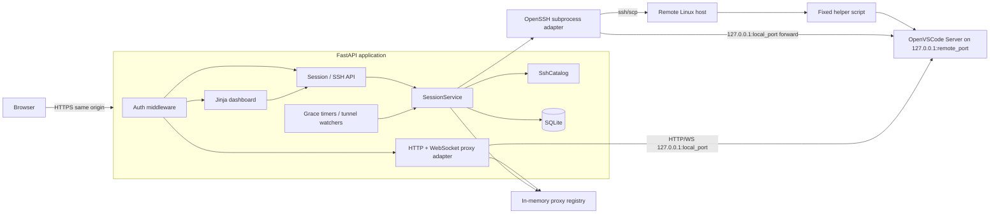
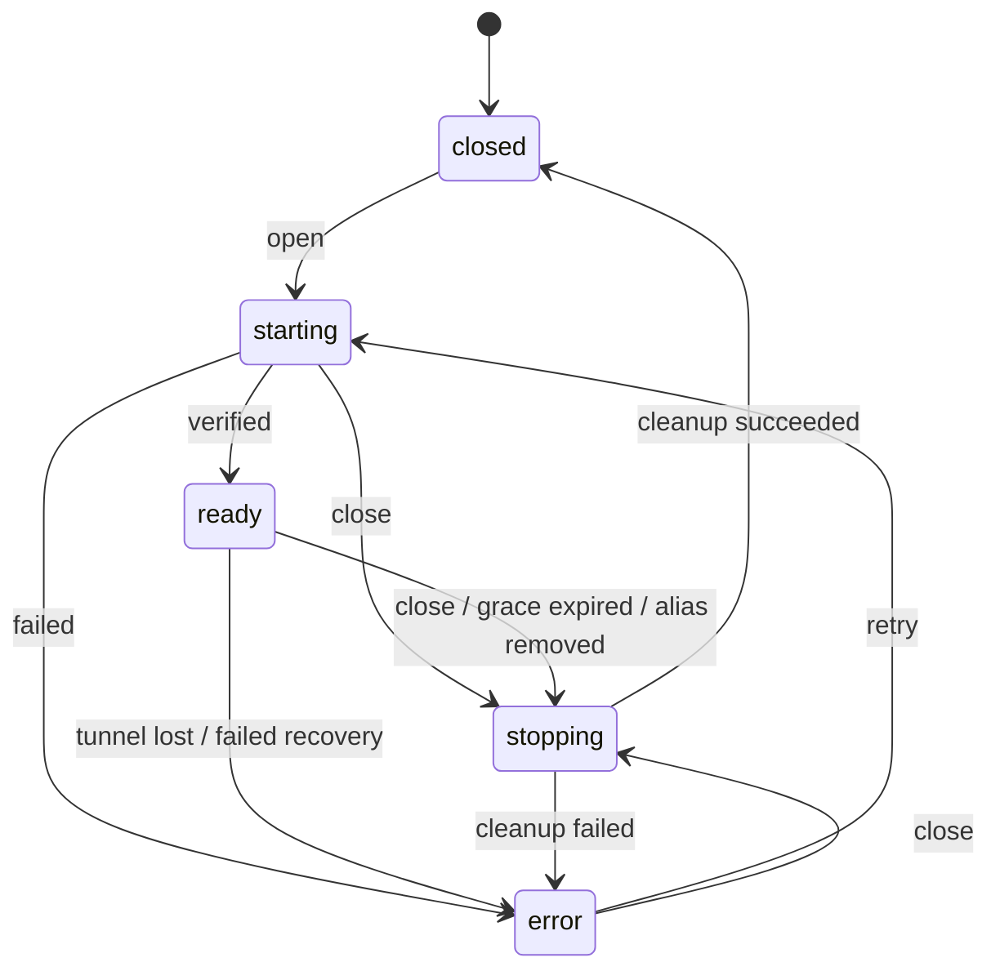

# OpenVSCode SSH Gateway

**Status:** Proposed greenfield rewrite  
**Target:** A smaller, single-process Python service preserving the gateway's essential behavior  
**Primary architectural decision:** The dashboard, control API, and proxied OpenVSCode editor share one authenticated origin and one application domain  
**Compatibility policy:** Preserve user-visible capabilities and operational safety, not the current TypeScript module boundaries, private APIs, database schema, or dual-origin security model

---

## 1. Executive summary

Rewrite the repository as a compact Python application that:

1. Discovers workspaces from positive, literal `Host` aliases in a dedicated OpenSSH configuration.
2. Uses the system `ssh`, `scp`, and `ssh-keygen` executables so OpenSSH remains responsible for `HostName`, `User`, `IdentityFile`, `ProxyJump`, host-key checking, agents, and other SSH behavior.
3. Starts a pinned OpenVSCode Server release on the selected remote host, bound to remote loopback and opened without a project folder.
4. Creates a loopback-only SSH local forward from the gateway host to the remote OpenVSCode process.
5. Proxies OpenVSCode HTTP and WebSocket traffic under the same origin as the dashboard.
6. Tracks one current session per SSH alias.
7. Closes a session explicitly or after the final browser connection remains absent for a configurable grace period.
8. Persists only the operational data needed to inspect, recover, or clean up live sessions after a gateway restart.
9. Keeps SSH configuration editing and SSH key management, but implements them through small, explicit services.
10. Uses mature Python libraries for HTTP, WebSocket, settings, templates, password hashing, validation, and SQLite access instead of reproducing those facilities.

The rewrite should intentionally remove:

- Separate control and editor origins.
- Editor grants and one-time handoff tokens.
- A second editor-authentication subsystem.
- OpenVSCode connection-token generation, encryption, storage, URL rewriting, and cookie rewriting.
- A generic internal event bus.
- Generic per-session command queues.
- The large desired-state/observed-state/retry state machine.
- Persistent local-port leases.
- Multiple repositories for tiny tables.
- A broad hexagonal architecture with an interface for every internal dependency.
- Automatic retry orchestration beyond a few bounded, local retries around known transient operations.

The resulting service should be understandable by reading roughly ten Python modules and one remote helper script.

---

## 2. Source-system assessment

The current repository already has several sound product decisions that should remain:

- A workspace is derived from a dedicated SSH config alias rather than a separately managed database record.
- The alias is both the workspace identifier and its display name.
- System OpenSSH resolves connection details.
- OpenVSCode starts folderless.
- One private editor run exists per open alias.
- Remote OpenVSCode and SSH forwards bind only to loopback.
- A browser-disconnect grace period delays cleanup.
- Startup recovery inspects unfinished runs and attempts safe cleanup or restoration.
- The OpenVSCode artifact is pinned and digest-verified.
- Remote process cleanup uses strong process identity rather than killing a PID blindly.

The current implementation also carries complexity that was justified by its original security model but is not required for this rewrite:

- The control plane and editor are dispatched by distinct origins.
- Editor access uses grants, secrets, handoff routes, token persistence, and proxy rewriting.
- The session model exposes many phases, desired state, runtime observations, tunnel observations, retry observations, and reconnect deadlines.
- The orchestrator contains queues, mutexes, abort controllers, event subscriptions, retry policies, recovery branches, and transition logic.
- The HTTP/WebSocket proxy implements significant authentication and transformation logic.
- Operational persistence is split across several repositories and tables.

The Python rewrite accepts a different trust boundary: authenticated OpenVSCode content is trusted to share the dashboard's origin. This is explicitly requested and should be documented as a product assumption, not presented as equivalent security to the current dual-origin design.

---

## 3. Goals

### 3.1 Functional goals

The first production-ready Python release must provide:

- Single-user password login and logout.
- Same-origin dashboard and editor access.
- SSH alias discovery from one dedicated SSH config file.
- Dashboard status for every discovered alias.
- Open, close, reopen, and retry actions.
- One active session per alias.
- A configurable maximum number of concurrent sessions.
- Remote capability checks for supported Linux architecture and required tools.
- Pinned OpenVSCode artifact download and SHA-256 verification.
- Idempotent remote runtime installation.
- Folderless OpenVSCode startup.
- Remote loopback binding.
- Local loopback SSH forwarding.
- Reverse proxying for OpenVSCode HTTP requests and WebSockets.
- Browser presence tracking based primarily on editor WebSocket connections.
- Disconnect grace-period cleanup.
- Explicit close even when the alias has been removed from the SSH config, provided a live session still exists.
- Startup recovery and orphan cleanup.
- SSH config read, validate, atomically replace, and reload.
- SSH public-key listing and Ed25519 key generation.
- Health and readiness endpoints.
- Structured logs with secret redaction.
- Unit, integration, and browser end-to-end tests.

### 3.2 Simplicity goals

The rewrite should optimize for:

- One application process.
- One public origin.
- One SQLite file.
- One active-session table.
- One main session service.
- No Redis, Celery, message broker, or distributed locks.
- No ORM unless the schema grows materially.
- No custom dependency-injection container.
- No internal event-bus abstraction.
- No automatic background worker separate from the web app.
- No compatibility layer for the current private TypeScript APIs.
- No persistence of data that can be derived from SSH config or remote inspection.
- No generic framework abstractions until a second concrete implementation exists.

### 3.3 Operational goals

- A gateway restart must not silently leak unmanaged remote OpenVSCode processes.
- A failed start must run best-effort cleanup.
- A failed stop must remain visible and retryable.
- Every subprocess call must have an explicit timeout and bounded output capture.
- Dynamic values must be passed as process arguments, never interpolated into shell command strings.
- Local and remote state directories must be private.
- The service must refuse unsafe startup configuration rather than silently weaken protections.

---

## 4. Non-goals

The Python rewrite will not initially provide:

- Multiple gateway users, organizations, teams, roles, or per-workspace ACLs.
- Multi-instance active/active deployment.
- Horizontal scaling.
- Kubernetes orchestration.
- Workspace CRUD separate from SSH aliases.
- A project-path picker before OpenVSCode starts.
- Remote file browsing in the dashboard.
- Arbitrary remote command execution.
- Arbitrary environment-variable injection into OpenVSCode.
- General-purpose SSH config parsing or normalization.
- Full support for every OpenSSH directive in the config editor.
- Full backward compatibility with the TypeScript database.
- Migration of current editor grants, encrypted secrets, or local-port leases.
- Reproduction of the dual-origin control/editor isolation.
- Reimplementation of SSH in Python.
- A bespoke reverse-proxy framework.
- Transparent reuse of an old session after an explicit Close; reopening always creates a fresh run.
- Guaranteed preservation of an editor session through every gateway crash. Recovery is best effort and safety-biased.

---

## 5. Architectural decisions

### ADR-001: Use one authenticated origin

Expose all browser surfaces from a single origin:

```text
https://gateway.example/
├── /login
├── /logout
├── /                         dashboard
├── /settings/ssh             SSH config page
├── /settings/keys            SSH keys page
├── /api/...                  JSON control API
└── /editor/{session_id}/...  proxied OpenVSCode HTTP and WebSocket traffic
```

Consequences:

- One signed session cookie authenticates both dashboard and editor proxy requests.
- No editor grants or handoff tokens are needed.
- OpenVSCode is started with `--without-connection-token`.
- The proxy does not inject or rewrite an OpenVSCode token.
- CSRF protection remains required for all gateway mutation routes.
- OpenVSCode JavaScript has same-origin access to gateway routes. This is accepted because the rewrite explicitly trusts the pinned OpenVSCode code and installed extensions sufficiently to share the origin.
- The deployment documentation must state that this is a weaker isolation boundary than a separate editor origin.

### ADR-002: Keep system OpenSSH as the SSH implementation

Invoke system binaries through `asyncio.create_subprocess_exec`:

- `ssh`
- `scp`
- `ssh-keygen`

Do not use a Python SSH protocol implementation as the primary transport.

Rationale:

- The core product promise is that normal OpenSSH `Host`, `IdentityFile`, `ProxyJump`, agent, certificate, host-key, and known-hosts behavior continues to work.
- Reproducing OpenSSH configuration semantics in Python would increase code and compatibility risk.
- AsyncSSH is capable and includes forwarding APIs, but adopting it would move configuration and compatibility responsibility into the application.
- Python still provides the orchestration and timeout model; OpenSSH remains the compatibility boundary.

Every invocation must include the dedicated config explicitly:

```text
ssh -F /path/to/gateway_ssh_config ...
scp -F /path/to/gateway_ssh_config ...
```

No command may use `shell=True`.

### ADR-003: Model one current session per alias

The persistent model is a `Session` keyed uniquely by SSH alias. A session has a private random identifier used in the editor URL and remote state directory.

The dashboard does not maintain a separate workspace domain object. It creates a projection by merging:

1. aliases currently discovered from SSH config; and
2. persisted live/error sessions, including sessions whose alias was removed while they were running.

This keeps “session” and “dashboard workspace” in one domain.

### ADR-004: Use five externally meaningful states

Use only:

```text
starting
ready
stopping
error
closed   (implicit when no active row exists)
```

Do not persist separate desired and observed states.

A `stage` field provides diagnostic precision without becoming another state machine:

```text
validate
install
start_remote
start_tunnel
verify
recover
stop
```

This removes `queued`, `validating`, `deploying`, `starting-runtime`, `starting-tunnel`, `verifying`, `degraded`, `retry-wait`, `failed`, and independent desired-state logic.

### ADR-005: Use direct service calls and per-alias locks

The session service exposes:

```python
async def open(alias: str) -> SessionView
async def close(alias: str, reason: CloseReason) -> None
async def retry(alias: str) -> SessionView
async def recover_all() -> RecoveryReport
async def reconcile_catalog() -> None
```

Concurrency is controlled by:

- one `asyncio.Lock` per alias;
- one global `asyncio.Semaphore` for session capacity;
- one application-lifespan task group for grace timers and tunnel watchers.

No generic command queue or event bus is required.

### ADR-006: Use SQLite directly through `aiosqlite`

Use explicit SQL and typed row mapping.

Do not introduce SQLAlchemy or another ORM for one operational table. Add an ORM only when the schema or query graph becomes complex enough to justify it.

Schema migrations use numbered SQL files plus `PRAGMA user_version`. This is sufficient for a single-process application with a small schema and avoids Alembic machinery.

### ADR-007: Keep a fixed remote helper, but shrink it

Retain a versioned POSIX shell helper because process management, `/proc` identity checks, safe extraction, and process-group signaling are most reliable on the remote Linux host.

Reduce its interface to fixed operations:

```text
capabilities
runtime-inspect
runtime-install
session-start
session-inspect
session-stop
session-remove
session-list
```

The helper must:

- whitelist operation names;
- validate every argument;
- never evaluate decoded data;
- emit one JSON object;
- use private directories;
- verify runtime archive digest before extraction;
- reject unsafe archive entries;
- persist PID, boot ID, process start ID, executable path, and bound port;
- signal the process group only after identity validation;
- never run arbitrary user-provided commands.

The existing helper is a good behavioral reference, but the Python rewrite may use a cleaner argument protocol and smaller implementation.

### ADR-008: Use a thin library-based proxy

Use:

- `httpx.AsyncClient` for streaming HTTP upstream requests and responses;
- `websockets` for the upstream WebSocket client;
- FastAPI/Starlette for downstream HTTP and WebSocket handling.

Application-owned proxy code should be restricted to:

- route lookup;
- gateway authentication;
- upstream URL construction;
- removal of hop-by-hop headers;
- removal of the gateway session cookie before forwarding;
- forwarding of safe request and response headers;
- bidirectional WebSocket frame relay;
- connection accounting;
- deterministic timeout and error mapping.

Do not implement HTTP parsing, WebSocket framing, compression, ping/pong framing, or TLS.

---

## 6. Proposed runtime architecture



### 6.1 Process model

Run one ASGI process with one worker:

```text
uvicorn vscode_gateway.app:create_app --factory --workers 1
```

A single worker is an architectural constraint in the first release because:

- alias locks are in process;
- capacity tracking is in process;
- tunnel subprocess handles are in process;
- WebSocket connection counts are in process;
- grace timers are in process.

The service should fail startup when configured with a multi-worker mode. If future multi-process deployment is required, it should be a separate design using external coordination.

### 6.2 Reverse proxy and TLS

Terminate TLS in a standard front proxy such as Caddy, nginx, or a platform ingress. Forward one origin to Uvicorn.

Required proxy behavior:

- preserve `Host`;
- set `X-Forwarded-Proto`;
- support WebSocket upgrades;
- set a generous read timeout for editor WebSockets;
- limit request-body size on gateway API routes;
- avoid response buffering for proxied editor streams where possible.

FastAPI should trust forwarded headers only from configured proxy IPs.

---

## 7. Python technology selection

| Concern | Choice | Reason |
|---|---|---|
| Language | Python 3.13+; production baseline may be 3.14 | Modern typing, `asyncio`, `TaskGroup`, and maintained runtime |
| Packaging | `uv` with `pyproject.toml` | Fast, deterministic dependency and environment management |
| Web framework | FastAPI + Starlette | Typed APIs, middleware, templates, lifespan, HTTP and WebSocket routes |
| ASGI server | Uvicorn | Standard FastAPI deployment path |
| Settings | `pydantic-settings` | Environment/file validation and clear startup failures |
| HTML | Jinja2 | Server-rendered dashboard with minimal browser code |
| Browser updates | Small vanilla JavaScript polling | Avoid a frontend build pipeline |
| Authentication | Starlette `SessionMiddleware` | Signed cookie sessions; no custom cookie format |
| Password hashing | `pwdlib[argon2]` | Modern password-hash verification |
| Data validation | Pydantic models | API and configuration validation |
| SQLite access | `aiosqlite` | Small asynchronous adapter without ORM overhead |
| HTTP client/proxy | HTTPX | Async streaming and connection pooling |
| WebSocket upstream | `websockets` | Correct protocol implementation and async client |
| SSH transport | System OpenSSH via `asyncio.create_subprocess_exec` | Preserve OpenSSH behavior |
| Retry helper | `tenacity`, only for bounded local retries | Avoid custom retry loops where retry is actually justified |
| IDs | Standard `uuid.uuid4()` or `uuid.uuid7()` when baseline supports it | No need for a separate ULID package |
| Logging | Standard `logging` plus `structlog` JSON rendering | Structured events with context binding |
| Tests | pytest + AnyIO plugin + HTTPX ASGI transport | Async unit/integration testing |
| Browser tests | Playwright for Python | End-to-end editor and dashboard flows |
| Lint/format | Ruff | One fast tool for formatting and linting |
| Type checking | Pyright or mypy in strict mode | Enforce service contracts |
| Security scan | Bandit and `pip-audit`/`uv audit` | Static checks and dependency advisories |

### 7.1 Deliberate library rejections

#### Do not use AsyncSSH as the default transport

AsyncSSH is a capable library, including local forwarding. It is not selected because the dedicated OpenSSH config is a product-level source of truth and compatibility surface. A later optional transport can be considered only if it passes a test suite covering the OpenSSH features users depend on.

#### Do not use SQLAlchemy initially

The operational schema is intentionally small. SQLAlchemy would add model, session, engine, and migration concepts without reducing enough code. Direct SQL also makes concurrency and transaction boundaries obvious.

#### Do not use Celery, RQ, Dramatiq, or Redis

Session start and stop are local orchestration jobs owned by a single process. A distributed job system would create more failure modes than it solves.

#### Do not use a SPA framework

The dashboard is a list of aliases with status and a few forms. Server-rendered Jinja templates and small polling code are sufficient.

---

## 8. Repository layout

```text
vscode-gateway-python/
├── pyproject.toml
├── uv.lock
├── README.md
├── LICENSE
├── src/
│   └── vscode_gateway/
│       ├── __init__.py
│       ├── app.py
│       ├── settings.py
│       ├── models.py
│       ├── errors.py
│       ├── db.py
│       ├── auth.py
│       ├── ssh.py
│       ├── runtime.py
│       ├── sessions.py
│       ├── proxy.py
│       ├── routes.py
│       ├── remote/
│       │   └── gateway-helper-v1.sh
│       ├── migrations/
│       │   └── 001_initial.sql
│       ├── templates/
│       │   ├── base.html
│       │   ├── login.html
│       │   ├── dashboard.html
│       │   ├── ssh_config.html
│       │   └── keys.html
│       └── static/
│           ├── app.css
│           └── dashboard.js
├── tests/
│   ├── unit/
│   │   ├── test_auth.py
│   │   ├── test_catalog.py
│   │   ├── test_db.py
│   │   ├── test_sessions.py
│   │   └── test_proxy_headers.py
│   ├── integration/
│   │   ├── fakes/
│   │   │   ├── ssh
│   │   │   ├── scp
│   │   │   └── ssh-keygen
│   │   ├── test_open_close.py
│   │   ├── test_recovery.py
│   │   └── test_proxy.py
│   └── e2e/
│       ├── compose.yaml
│       ├── test_dashboard.py
│       └── test_editor.py
├── scripts/
│   ├── create-password-hash.py
│   └── verify-release.py
└── deploy/
    ├── vscode-gateway.service
    └── Caddyfile.example
```

### 8.1 Module responsibilities

#### `app.py`

- Create settings.
- Validate filesystem and process prerequisites.
- Initialize logging.
- Open database.
- Create shared HTTP client.
- Build services.
- Run migrations.
- Run startup recovery.
- Start the lifespan task group.
- Register routes and middleware.
- Close sessions, subprocesses, clients, and database on graceful shutdown.

#### `settings.py`

One Pydantic settings model. It must validate:

- canonical public origin;
- bind host and port;
- state/runtime paths;
- SSH config and keys paths;
- password hash path;
- session secret path;
- OpenSSH executable paths;
- OpenVSCode version, download URLs, and SHA-256 values by platform;
- session capacity;
- startup/stop/proxy timeouts;
- disconnect grace period;
- trusted proxy networks;
- allowed hostnames.

No service should read environment variables directly.

#### `models.py`

Contain only shared typed data:

- `SessionState`
- `SessionStage`
- `CloseReason`
- `SessionRecord`
- `SessionView`
- `WorkspaceView`
- `SshAlias`
- `RuntimeIdentity`
- `TunnelIdentity`
- request and response Pydantic models

Avoid dozens of tiny nominal ID wrappers unless they prevent a real class of bug.

#### `errors.py`

Define one application exception family and a small error-code enum.

#### `db.py`

- Database opening and PRAGMAs.
- Migration runner.
- Session CRUD.
- Transactions.
- Row-to-dataclass mapping.
- No generic repository abstraction.

#### `auth.py`

- Login/logout.
- Session cookie helpers.
- CSRF generation and verification.
- Password hash loading and verification.
- Login throttling.
- Route dependencies for authenticated HTTP and WebSocket requests.

#### `ssh.py`

- SSH alias catalog.
- SSH config revision/hash.
- OpenSSH invocation.
- `scp` transfer.
- Local-forward process creation.
- Key listing and generation.
- Subprocess timeout/output helpers.
- No remote runtime semantics.

#### `runtime.py`

- Artifact cache and SHA-256 verification.
- Remote helper installation.
- Runtime capability inspection.
- Remote runtime installation.
- Session start/inspect/stop/remove.
- Parse and validate helper JSON responses.

#### `sessions.py`

- Open, close, retry, recovery, catalog reconciliation.
- Per-alias locks.
- Capacity semaphore.
- Proxy target registry updates.
- Browser presence accounting.
- Grace timers.
- Tunnel-exit watchers.
- Conversion to dashboard/API views.

#### `proxy.py`

- HTTP proxy route.
- WebSocket proxy route.
- Header filtering.
- Cookie removal.
- Connection lifecycle callback into `SessionService`.

#### `routes.py`

- Dashboard HTML routes.
- JSON API routes.
- SSH configuration routes.
- Key routes.
- Health/readiness routes.
- Exception-to-problem-response mapping.

---

## 9. Unified domain model

### 9.1 Identity

```python
SshAlias = str
SessionId = UUID
```

Rules:

- The SSH alias is the stable workspace identity.
- The session ID is private operational identity.
- A new session ID is generated whenever a closed alias is reopened.
- Session IDs appear in editor paths so stale editor URLs cannot attach to a later run for the same alias.
- The API primarily addresses actions by alias because that is what the user understands.
- Proxy requests address a specific session ID and are rejected if that ID is not currently `ready`.

### 9.2 Workspace projection

A workspace is not persisted. It is rendered from:

```python
@dataclass(frozen=True)
class WorkspaceView:
    alias: str
    state: Literal["closed", "starting", "ready", "stopping", "error"]
    session_id: UUID | None
    editor_url: str | None
    connected_clients: int
    disconnect_deadline: datetime | None
    stage: str | None
    error_code: str | None
    error_message: str | None
    can_open: bool
    can_close: bool
    can_retry: bool
```

Projection rules:

- Config alias with no session row → `closed`.
- Session row with alias still in config → show current state.
- Session row whose alias was removed → continue showing it until stopped, with `catalog_missing=true`.
- `editor_url` exists only in `ready`.
- `can_open` is true only in `closed`.
- `can_close` is true in `starting`, `ready`, `stopping`, and `error` when cleanup resources may exist.
- `can_retry` is true in `error`.
- Dashboard ordering:
  1. `ready`
  2. `starting`
  3. `stopping`
  4. `error`
  5. `closed`
  6. alias lexicographically within each group

### 9.3 Persisted session

```python
@dataclass
class SessionRecord:
    id: UUID
    alias: str
    state: SessionState
    stage: SessionStage | None

    remote_pid: int | None
    remote_port: int | None
    remote_boot_id: str | None
    remote_process_start_id: str | None
    remote_executable: str | None

    local_port: int | None
    tunnel_pid: int | None

    connected_clients: int
    last_connected_at: datetime | None
    last_disconnected_at: datetime | None
    disconnect_deadline_at: datetime | None

    error_code: str | None
    error_message: str | None
    close_reason: str | None

    created_at: datetime
    updated_at: datetime
```

Do not persist:

- editor tokens;
- editor grants;
- control tokens;
- HTTP proxy socket objects;
- asyncio tasks;
- locks;
- password material;
- SSH private-key contents;
- full SSH command output;
- derived editor URLs.

### 9.4 State transitions



Transition rules:

- `closed` is represented by the absence of a session row.
- Only one row may exist for an alias.
- Only the session service writes state.
- Open is idempotent:
  - `starting` or `ready` returns the existing view.
  - `stopping` returns conflict.
  - `error` returns conflict with a Retry instruction.
- Close is idempotent:
  - no row returns success;
  - `stopping` returns accepted;
  - any other row begins or continues cleanup.
- Retry first performs cleanup for the errored record, then starts a fresh session ID.
- A start failure must preserve enough information to retry cleanup.
- A successful stop deletes the row.

### 9.5 Error codes

Keep the stable set small:

```text
alias_not_found
capacity_reached
ssh_unreachable
ssh_config_invalid
remote_unsupported
runtime_download_failed
runtime_digest_mismatch
runtime_install_failed
remote_start_failed
remote_identity_conflict
tunnel_start_failed
tunnel_lost
editor_unhealthy
startup_timeout
stop_failed
recovery_failed
internal_error
```

`stage` and a safe operator message provide detail. Full stderr belongs only in redacted structured logs, with bounded length.

---

## 10. SQLite design

### 10.1 Initial schema

```sql
PRAGMA foreign_keys = ON;

CREATE TABLE sessions (
    id TEXT PRIMARY KEY,
    alias TEXT NOT NULL UNIQUE,

    state TEXT NOT NULL
        CHECK (state IN ('starting', 'ready', 'stopping', 'error')),
    stage TEXT
        CHECK (
            stage IS NULL OR
            stage IN (
                'validate',
                'install',
                'start_remote',
                'start_tunnel',
                'verify',
                'recover',
                'stop'
            )
        ),

    remote_pid INTEGER,
    remote_port INTEGER,
    remote_boot_id TEXT,
    remote_process_start_id TEXT,
    remote_executable TEXT,

    local_port INTEGER,
    tunnel_pid INTEGER,

    connected_clients INTEGER NOT NULL DEFAULT 0
        CHECK (connected_clients >= 0),
    last_connected_at TEXT,
    last_disconnected_at TEXT,
    disconnect_deadline_at TEXT,

    error_code TEXT,
    error_message TEXT,
    close_reason TEXT,

    created_at TEXT NOT NULL,
    updated_at TEXT NOT NULL
);

CREATE INDEX sessions_state_idx ON sessions(state);
CREATE INDEX sessions_disconnect_deadline_idx
    ON sessions(disconnect_deadline_at)
    WHERE disconnect_deadline_at IS NOT NULL;

PRAGMA user_version = 1;
```

### 10.2 Database configuration

On open:

```sql
PRAGMA journal_mode = WAL;
PRAGMA synchronous = NORMAL;
PRAGMA foreign_keys = ON;
PRAGMA busy_timeout = 5000;
```

Use one long-lived application connection or a very small explicit connection strategy. SQLite has one writer; the application already serializes per-alias operations, so a pool is unnecessary.

### 10.3 Transaction rules

- State changes and resource identity updates happen in one transaction.
- Never hold a SQLite transaction open while awaiting SSH, network, or subprocess work.
- Pattern:
  1. lock alias;
  2. persist intention/state;
  3. perform external operation;
  4. persist observation/result.
- Every update uses `updated_at`.
- Use compare-and-set where stale task completion is possible:
  `UPDATE ... WHERE id = ? AND state = ?`.
- Startup recovery runs before readiness becomes true.

### 10.4 Migration policy

- Migrations are append-only numbered SQL files.
- The runner reads `PRAGMA user_version`.
- Each migration runs in an exclusive transaction.
- Database files newer than the binary understands cause startup failure.
- Back up the SQLite file before a destructive future migration.
- The initial cutover does not migrate the TypeScript operational database; it starts a new database after old sessions are closed.

---

## 11. SSH alias catalog

### 11.1 Discovery behavior

The dedicated SSH config is the source of truth.

Discover aliases by scanning `Host` lines and retaining tokens that are:

- positive;
- literal;
- not `*`;
- not prefixed by `!`;
- free of wildcard characters `*`, `?`, and `[...]`;
- valid UTF-8;
- within a conservative length limit;
- safe to pass as a single subprocess argument.

For each candidate alias, run:

```text
ssh -F <config> -G <alias>
```

The alias is considered valid only when OpenSSH successfully resolves it.

Do not build a complete SSH config parser. The scanner extracts candidate aliases; OpenSSH validates semantics.

### 11.2 Catalog caching

Maintain an immutable catalog snapshot:

```python
@dataclass(frozen=True)
class CatalogSnapshot:
    revision: str
    aliases: tuple[str, ...]
    loaded_at: datetime
    error: str | None
```

- `revision` is SHA-256 of config bytes.
- Refresh at startup, after a successful edit, and periodically at a low frequency.
- If refresh fails, retain the last valid snapshot and mark the catalog stale.
- Do not close sessions merely because the config is temporarily unreadable.
- Close a live session for a removed alias only after a successfully validated new snapshot proves the alias is absent.

### 11.3 Config editor

API behavior:

```text
GET /api/ssh/config
PUT /api/ssh/config
```

`GET` response:

```json
{
  "text": "...",
  "revision": "sha256:..."
}
```

`PUT` request:

```json
{
  "text": "...",
  "expectedRevision": "sha256:..."
}
```

Write algorithm:

1. Require authenticated session and valid CSRF token.
2. Reject when `expectedRevision` differs from current file hash.
3. Enforce byte-size and line-length limits.
4. Reject NUL bytes and invalid UTF-8.
5. Write to a temporary file in the same directory with mode `0600`.
6. Validate high-risk policy.
7. Discover candidates from the temporary file.
8. Run `ssh -F <temp> -G <alias>` for each candidate.
9. `fsync` the temporary file.
10. Atomically replace the target with `os.replace`.
11. `fsync` the parent directory.
12. Publish the new catalog snapshot.
13. Reconcile sessions for aliases that were removed.

### 11.4 Unsafe-directive policy

For a web-editable dedicated config, reject directives that expand the gateway into a command-execution or forwarding tool unless explicitly reviewed:

```text
Include
Match
ProxyCommand
LocalCommand
PermitLocalCommand
RemoteCommand
LocalForward
RemoteForward
DynamicForward
Tunnel
CanonicalizeHostname
KnownHostsCommand
PKCS11Provider
SecurityKeyProvider
```

`ProxyJump` remains allowed because it is a core use case and is executed by OpenSSH without a shell command.

This policy is intentionally conservative. It can be relaxed only with tests and threat-model updates.

---

## 12. SSH subprocess adapter

### 12.1 One safe subprocess primitive

Implement one helper:

```python
async def run_process(
    argv: Sequence[str],
    *,
    timeout: float,
    stdin: bytes | None = None,
    max_stdout: int = 1_000_000,
    max_stderr: int = 1_000_000,
    env: Mapping[str, str] | None = None,
) -> ProcessResult:
    ...
```

Requirements:

- uses `asyncio.create_subprocess_exec`;
- never uses a shell;
- starts a new local process group when cleanup requires it;
- enforces timeout;
- sends TERM then KILL on timeout;
- bounds captured output;
- decodes with replacement only for logs;
- preserves raw bytes when parsing a protocol;
- logs executable and redacted argument classes, not secrets;
- returns exit code, stdout, stderr, duration, and timeout status.

### 12.2 Connectivity probe

Use a fixed command:

```text
ssh
  -F <config>
  -o BatchMode=yes
  -o ConnectTimeout=<seconds>
  -o ServerAliveInterval=15
  -o ServerAliveCountMax=2
  --
  <alias>
  /bin/sh <remote-helper> capabilities
```

The exact remote command should remain a fixed helper invocation. Dynamic values are encoded as validated arguments.

### 12.3 Local tunnel process

Start:

```text
ssh
  -F <config>
  -N
  -T
  -o BatchMode=yes
  -o ExitOnForwardFailure=yes
  -o ServerAliveInterval=15
  -o ServerAliveCountMax=2
  -L 127.0.0.1:<local_port>:127.0.0.1:<remote_port>
  --
  <alias>
```

Store:

- child process object in memory;
- PID and local port in SQLite for diagnostics/recovery;
- watcher task that waits for process exit.

The watcher calls `SessionService.on_tunnel_exit(session_id, return_code)`. This direct callback replaces an event bus.

### 12.4 Local port allocation

Because only one gateway process is supported:

1. Ask the kernel for an ephemeral loopback port by binding a temporary socket to `127.0.0.1:0`.
2. Read the selected port.
3. Close the socket.
4. Immediately start OpenSSH with `ExitOnForwardFailure`.
5. If the port was raced, choose another port and retry a small bounded number of times.

No persistent port-lease table is needed. During recovery, create a new local forward and update the row.

---

## 13. OpenVSCode artifact and remote runtime

### 13.1 Artifact manifest

Configuration includes a manifest per supported platform:

```toml
[openvscode]
version = "x.y.z"

[openvscode.platforms.linux-x64]
url = "https://..."
sha256 = "..."

[openvscode.platforms.linux-arm64]
url = "https://..."
sha256 = "..."
```

Do not discover “latest” at runtime.

### 13.2 Local cache

Cache key:

```text
<version>/<platform>/<sha256>/openvscode-server.tar.gz
```

Download algorithm:

- acquire an in-process lock per digest;
- stream with HTTPX to a temporary file;
- enforce a maximum size;
- compute SHA-256 while streaming;
- reject mismatched digest;
- `fsync` and atomically rename;
- reuse only after rechecking expected size/digest metadata as configured.

### 13.3 Remote install

Flow:

1. Run helper `capabilities`.
2. Select manifest entry from reported architecture.
3. Run helper `runtime-inspect`.
4. If exact digest is installed, continue.
5. Copy archive with `scp` to a random private temporary path.
6. Invoke helper `runtime-install <path> <sha256> <version>`.
7. Helper verifies SHA-256 again on the remote host.
8. Helper safely extracts to a temporary directory under its managed root.
9. Helper verifies the OpenVSCode executable and required flags.
10. Helper atomically promotes the runtime directory.
11. Helper removes the transferred archive.

Runtime installation is idempotent and convergent.

### 13.4 Remote session start

The helper starts OpenVSCode approximately as follows:

```text
openvscode-server
  --host 127.0.0.1
  --port 0
  --server-base-path /editor/<session_id>
  --without-connection-token
  --user-data-dir <private-session-dir>/user-data
  --server-data-dir <private-session-dir>/server-data
  --logsPath <private-session-dir>/logs
  --disable-telemetry
  --reconnection-grace-time <seconds>
```

Before implementation, the pinned OpenVSCode release must be probed with `--help` and an integration test must confirm the exact base-path flag and behavior. The existing repository verifies and uses `server-base-path`; the rewrite should preserve a runtime capability check rather than assume all releases expose the same flag.

The helper must:

- allocate a private session directory;
- launch in a new process session/process group;
- redirect logs to private files;
- discover the bound loopback port;
- store process identity;
- return JSON containing PID, port, boot ID, process start ID, and executable path.

No connection-token file is created.

### 13.5 Remote process identity

A running process may be signaled only when all available identity fields match:

- PID;
- host boot ID;
- process start ID from `/proc/<pid>/stat`;
- executable path or expected command identity;
- managed session directory.

If identity does not match, return `remote_identity_conflict`; do not kill the process.

### 13.6 Remote stop

1. Inspect identity.
2. If absent, treat as success.
3. If conflict, return error and retain the session row.
4. Send TERM to the OpenVSCode process group.
5. Wait a bounded interval.
6. Revalidate identity.
7. Send KILL only when identity still matches.
8. Preserve bounded logs for diagnosis.
9. Remove managed session data according to retention policy.

---

## 14. Session service algorithms

### 14.1 Open

```python
async def open(alias: str) -> SessionView:
    async with alias_lock(alias):
        catalog = catalog_service.snapshot()

        if not catalog.is_valid_alias(alias):
            raise AliasNotFound(alias)

        existing = await db.get_by_alias(alias)
        if existing:
            if existing.state in {STARTING, READY}:
                return to_view(existing)
            if existing.state == STOPPING:
                raise Conflict("session is stopping")
            if existing.state == ERROR:
                raise Conflict("session is in error; retry or close it")

        capacity.acquire_nowait_or_raise()

        session = new_starting_session(alias)
        await db.insert(session)

        try:
            await update_stage(session, VALIDATE)
            capabilities = await runtime.capabilities(alias)

            await update_stage(session, INSTALL)
            await runtime.ensure_installed(alias, capabilities.platform)

            await update_stage(session, START_REMOTE)
            remote = await runtime.start_session(alias, session.id)
            await db.set_remote_identity(session.id, remote)

            await update_stage(session, START_TUNNEL)
            tunnel = await ssh.start_local_forward(
                alias=alias,
                remote_port=remote.port,
            )
            await db.set_tunnel_identity(session.id, tunnel)
            registry.add(session.id, tunnel.local_port)
            start_tunnel_watcher(session.id, tunnel.process)

            await update_stage(session, VERIFY)
            await verify_editor_health(session.id, tunnel.local_port)

            ready = await db.mark_ready(session.id)
            return to_view(ready)

        except CancelledError:
            await best_effort_cleanup(session.id)
            raise
        except GatewayError as exc:
            await best_effort_cleanup_partial_resources(session.id)
            await db.mark_error(session.id, exc.code, exc.safe_message)
            raise
        finally:
            if final state is not active:
                capacity.release()
```

Implementation detail: the HTTP request should not necessarily remain open for the entire remote startup. Two acceptable API styles exist:

- `POST /open` performs startup and returns when `ready` or `error`; simplest server logic, but browser request may be long.
- `POST /open` persists `starting`, schedules the operation in the lifespan task group, and returns `202`; dashboard polls status.

Choose the second style for production. It keeps request deadlines independent from SSH startup while still avoiding a generic job queue. The operation is just one named task stored by session ID.

### 14.2 Close

```python
async def close(alias: str, reason: CloseReason) -> None:
    async with alias_lock(alias):
        session = await db.get_by_alias(alias)
        if session is None:
            return

        await db.mark_stopping(session.id, reason)
        cancel_start_task_if_present(session.id)
        cancel_grace_timer(session.id)
        registry.remove(session.id)

        errors = []

        tunnel = get_tunnel_handle(session.id)
        if tunnel:
            errors += await terminate_tunnel(tunnel)
        elif session.tunnel_pid:
            errors += await terminate_owned_local_process(session.tunnel_pid)

        if session.remote_pid or session.state != STARTING:
            errors += await runtime.stop_session(alias, session.id)

        if errors:
            await db.mark_error(
                session.id,
                code="stop_failed",
                message=safe_summary(errors),
                stage="stop",
            )
            return

        await runtime.remove_session(alias, session.id)
        await db.delete(session.id)
        capacity.release_if_held(session.id)
```

Close should be scheduled as a background operation and return `202` unless there is nothing to close.

### 14.3 Retry

Retry is not a state transition within the same run.

1. Lock alias.
2. Close/clean the errored session.
3. If cleanup cannot establish safety, leave it in `error`.
4. Delete the old row only after cleanup succeeds or resources are proven absent.
5. Invoke Open to create a fresh session ID.

### 14.4 Tunnel exit

When the OpenSSH local-forward process exits:

- ignore if the session is already `stopping`;
- remove the proxy registry target immediately;
- mark the session `error/tunnel_lost`;
- schedule best-effort remote stop;
- keep the error visible if remote cleanup fails.

Do not implement automatic exponential tunnel recreation in the first release. The user can Retry. This makes behavior deterministic and avoids hiding unstable SSH conditions.

### 14.5 Catalog reconciliation

After a successfully validated catalog refresh:

- for every session whose alias is absent:
  - schedule Close with reason `alias_removed`;
- do not create or delete database rows for closed aliases;
- do not act when the catalog snapshot is stale or invalid.

### 14.6 Capacity

- `max_sessions` counts `starting`, `ready`, `stopping`, and resource-bearing `error` sessions.
- A stop releases capacity only after resources are absent and the row is deleted.
- Capacity is rebuilt from the database during startup recovery.
- A global semaphore prevents concurrent starts beyond the limit.
- The database uniqueness constraint prevents two sessions for one alias.

---

## 15. Startup recovery

Readiness remains false until recovery completes or reaches a safe degraded result.

### 15.1 Recovery goals

- Reattach to remote OpenVSCode processes when identity is valid.
- Recreate local SSH forwards; old forward processes are not assumed reusable.
- Remove rows whose resources are proven absent.
- Stop orphaned managed remote sessions that are not represented locally.
- Never kill a process with conflicting identity.
- Surface unresolved conflicts to the dashboard.

### 15.2 Per-row recovery

For each persisted row under an alias lock:

#### `starting`

1. Inspect the remote session.
2. If running, recreate a local tunnel and health-check.
3. If healthy, mark `ready`.
4. If absent, delete the row.
5. If conflict or unreachable, mark `error/recovery_failed`.

#### `ready`

1. Ignore persisted local tunnel PID as authoritative.
2. Terminate an owned leftover local tunnel if safely identifiable.
3. Inspect remote identity.
4. If running, start a new local tunnel.
5. Verify editor health.
6. Restore registry and `ready`.
7. If absent, delete the row.
8. If conflict/unreachable, mark `error`.

#### `stopping`

Continue Close.

#### `error`

- Inspect known resources.
- If all are absent, retain the error briefly for visibility or delete according to policy.
- If resources remain and identity matches, allow the operator to Close or Retry.
- Do not automatically restart an error session.

### 15.3 Remote orphan scan

For every currently discoverable alias, call helper `session-list` only when needed.

Compare remote managed session IDs with local rows:

- Local row exists → handled by per-row recovery.
- No local row exists:
  - inspect identity;
  - stop and remove it because the gateway can no longer authenticate or route that run safely.

If an alias has been removed from config, the gateway may be unable to reach it. Preserve the local error row with actionable text rather than deleting evidence.

### 15.4 Recovery deadline

Recovery has a global configured deadline. When exceeded:

- cancel outstanding probes;
- mark affected rows `error/recovery_failed`;
- finish startup in a degraded-but-operable state;
- set readiness true only if the application can safely serve dashboard actions;
- include unresolved count in `/readyz`.

---

## 16. Same-origin editor proxy

### 16.1 Route resolution

Public base:

```text
/editor/{session_id}/
```

For every HTTP or WebSocket request:

1. Authenticate the gateway session cookie.
2. Parse and validate `session_id`.
3. Look up the session in an in-memory registry.
4. Confirm database/session state is `ready`.
5. Resolve upstream to `127.0.0.1:<local_port>`.
6. Preserve the remaining path and query string.
7. Proxy the request.

Do not route by alias. A stale URL for an old run must fail after reopen.

### 16.2 HTTP proxy

Use one process-wide `httpx.AsyncClient` with:

- environment proxy use disabled;
- no automatic redirects;
- explicit connect/read/write/pool timeouts;
- connection pooling;
- HTTP/1.1 upstream unless a verified need exists otherwise.

Request handling:

- stream request body to upstream;
- copy method, path, and query;
- set upstream `Host` to loopback target or the value OpenVSCode expects;
- set `X-Forwarded-Proto`, `X-Forwarded-Host`, and `X-Forwarded-Prefix`;
- drop hop-by-hop headers;
- remove the gateway authentication cookie from `Cookie`;
- preserve OpenVSCode cookies if any exist;
- stream response body back;
- filter hop-by-hop response headers;
- do not buffer large assets.

Drop at minimum:

```text
Connection
Keep-Alive
Proxy-Authenticate
Proxy-Authorization
TE
Trailer
Transfer-Encoding
Upgrade
```

Handle `Set-Cookie` conservatively. Because OpenVSCode runs at its configured base path and without a connection token, avoid rewriting cookies unless an integration test demonstrates a concrete need.

### 16.3 WebSocket proxy

Flow:

1. Authenticate downstream WebSocket before `accept`.
2. Resolve ready session.
3. Build upstream `ws://127.0.0.1:<port>/<path>?<query>`.
4. Forward requested subprotocols.
5. Connect with `websockets.connect`.
6. Accept downstream with the selected subprotocol.
7. Start two tasks in an `asyncio.TaskGroup`:
   - downstream → upstream;
   - upstream → downstream.
8. Preserve text/binary frame type.
9. Propagate normal close code and reason where valid.
10. Cancel the peer relay when either direction exits.
11. Decrement presence exactly once in `finally`.

The `websockets` package owns protocol framing, ping/pong, close handling, compression negotiation, and flow control.

### 16.4 Presence tracking

Primary signal: active editor WebSocket count.

In memory:

```python
dict[SessionId, int]
```

On first connection:

- cancel grace timer;
- set count to 1;
- clear disconnect deadline;
- update `last_connected_at`.

On additional connection:

- increment count.

On disconnect:

- decrement, never below zero;
- when count reaches zero:
  - persist `last_disconnected_at`;
  - set `disconnect_deadline_at = now + grace`;
  - create one grace task.

On grace expiry:

1. re-read session;
2. confirm it is `ready`;
3. confirm in-memory count is zero;
4. confirm deadline has elapsed;
5. schedule Close with reason `disconnect_grace_expired`.

HTTP requests alone should not reset the grace timer. VS Code creates durable WebSockets that are a better presence signal than asset requests.

### 16.5 Grace timers after restart

After recovery:

- session restored to `ready` with no connected browser:
  - if persisted deadline is in the future, recreate timer;
  - if deadline is in the past, schedule Close;
  - if no deadline exists, set a fresh grace deadline.
- a newly attached WebSocket cancels the timer.

---

## 17. Authentication and browser security

### 17.1 Password source

Use one Argon2 password hash stored in a private file:

```text
state/
├── password.hash    mode 0600
└── session.secret   mode 0600, at least 32 random bytes
```

The gateway never stores a plaintext password.

Provide an admin script:

```text
python scripts/create-password-hash.py
```

### 17.2 Cookie session

Use Starlette `SessionMiddleware` with:

- `https_only=True` in production;
- `same_site="lax"`;
- `path="/"`;
- a short, configurable maximum age;
- session payload containing only:
  - authenticated flag;
  - issued timestamp;
  - session generation;
  - CSRF secret.

The cookie is signed, not a place for confidential data.

### 17.3 Session invalidation

A `session_generation` integer is loaded from configuration or a small state file. Rotating it invalidates all existing browser sessions.

Logout clears the cookie.

### 17.4 CSRF

Every state-changing route requires:

- authenticated cookie; and
- CSRF token in a form field or `X-CSRF-Token`.

Use a random per-login token stored in the signed session and rendered into the dashboard.

Because OpenVSCode shares the origin, trusted editor JavaScript can potentially access same-origin pages and obtain a CSRF token. CSRF still blocks cross-site requests, but it is not an isolation boundary against OpenVSCode or extensions. This limitation must be explicit.

### 17.5 Login throttling

Use a small in-memory limiter keyed by normalized client IP:

- limited burst;
- exponential delay after failures;
- reset on success;
- bounded map with expiry.

A library such as `limits` may be used, but a minimal fixed-window implementation is acceptable if it remains isolated and fully tested. Do not add Redis for a single-process service.

### 17.6 HTTP hardening

Add:

- `TrustedHostMiddleware`;
- HTTPS redirect when deployed without an upstream redirect;
- Content Security Policy for dashboard pages;
- `X-Content-Type-Options: nosniff`;
- `Referrer-Policy: no-referrer`;
- `Permissions-Policy`;
- no caching for authenticated HTML/API responses;
- strict input and body-size limits.

Do not inject a dashboard CSP into proxied OpenVSCode responses. OpenVSCode requires its own script/style policy.

---

## 18. Dashboard design

### 18.1 Rendering approach

Use Jinja2 templates with a small CSS file and a small JavaScript module.

No Node build, bundler, React, or frontend state store.

The dashboard page:

- renders the first workspace snapshot server-side;
- polls `GET /api/sessions` every two seconds while visible;
- slows or pauses polling when the tab is hidden;
- replaces card status from JSON;
- sends mutations with `fetch` and CSRF header;
- disables duplicate action buttons while a request is pending.

### 18.2 Workspace card

Display:

- alias;
- status;
- current stage;
- connected browser count;
- disconnect countdown;
- safe error message;
- Open Editor button;
- Open, Close, or Retry button as applicable;
- stale/missing-config warning.

### 18.3 SSH config page

Provide:

- monospaced text editor;
- current revision;
- Validate/Save action;
- validation errors with line hints where possible;
- discovered alias preview;
- warning for directives prohibited by policy.

Do not attempt a form builder for all OpenSSH directives.

### 18.4 SSH key page

Provide:

- key name;
- algorithm;
- public-key fingerprint;
- creation or file modification time;
- public-key download/copy;
- Generate Ed25519 key action;
- Delete action with confirmation.

Private-key bytes must never be returned by an API after generation. If key generation must expose a private key for a specific bootstrap workflow, design that separately with a one-time download and explicit threat review; it is out of scope for the initial rewrite.

---

## 19. HTTP API

All JSON errors use `application/problem+json`:

```json
{
  "type": "urn:vscode-gateway:error:capacity_reached",
  "title": "Session capacity reached",
  "status": 409,
  "detail": "Close an existing session before opening another.",
  "code": "capacity_reached",
  "requestId": "..."
}
```

### 19.1 Authentication

```text
GET  /login
POST /login
POST /logout
```

### 19.2 Dashboard and sessions

```text
GET  /
GET  /api/sessions
GET  /api/sessions/{alias}
POST /api/sessions/{alias}/open
POST /api/sessions/{alias}/close
POST /api/sessions/{alias}/retry
```

Use URL-encoded alias path segments and reject ambiguous normalization. Alternatively, place aliases in JSON bodies if testing reveals proxy/router ambiguity with unusual valid SSH aliases.

Responses:

- `GET` → `200`.
- Open/Close/Retry scheduled → `202`.
- Idempotent already-open Open → `200`.
- Idempotent already-closed Close → `204`.
- Alias missing → `404`.
- Capacity or transition conflict → `409`.
- Catalog unavailable → `503`.

### 19.3 SSH config

```text
GET /api/ssh/config
PUT /api/ssh/config
GET /api/ssh/catalog
```

### 19.4 SSH keys

```text
GET    /api/ssh/keys
POST   /api/ssh/keys
GET    /api/ssh/keys/{name}.pub
DELETE /api/ssh/keys/{name}
```

Key names must match a conservative pattern such as:

```text
^[A-Za-z0-9][A-Za-z0-9._-]{0,63}$
```

### 19.5 Operations

```text
GET /healthz
GET /readyz
GET /api/version
```

`/healthz` indicates the process event loop is serving.

`/readyz` indicates:

- migrations completed;
- state directories are usable;
- session secret and password hash loaded;
- SSH config has at least one valid snapshot or a clearly reported empty snapshot;
- startup recovery completed;
- no unrecoverable application-wide invariant failed.

Individual broken aliases do not make the whole gateway unready.

---

## 20. Configuration

Example environment:

```dotenv
GATEWAY_PUBLIC_ORIGIN=https://gateway.example
GATEWAY_BIND_HOST=127.0.0.1
GATEWAY_BIND_PORT=8080

GATEWAY_STATE_DIR=/var/lib/vscode-gateway
GATEWAY_RUNTIME_DIR=/var/cache/vscode-gateway
GATEWAY_PASSWORD_HASH_FILE=/var/lib/vscode-gateway/password.hash
GATEWAY_SESSION_SECRET_FILE=/var/lib/vscode-gateway/session.secret

GATEWAY_SSH_CONFIG=/var/lib/vscode-gateway/ssh/config
GATEWAY_SSH_KEYS_DIR=/var/lib/vscode-gateway/ssh/keys
GATEWAY_SSH_BIN=/usr/bin/ssh
GATEWAY_SCP_BIN=/usr/bin/scp
GATEWAY_SSH_KEYGEN_BIN=/usr/bin/ssh-keygen

GATEWAY_MAX_SESSIONS=4
GATEWAY_DISCONNECT_GRACE_SECONDS=300
GATEWAY_STARTUP_TIMEOUT_SECONDS=120
GATEWAY_STOP_TIMEOUT_SECONDS=30
GATEWAY_PROXY_CONNECT_TIMEOUT_SECONDS=5

GATEWAY_OPENVSCODE_VERSION=x.y.z
GATEWAY_OPENVSCODE_MANIFEST_FILE=/etc/vscode-gateway/openvscode.toml

GATEWAY_ALLOWED_HOSTS=gateway.example
GATEWAY_TRUSTED_PROXIES=127.0.0.1/32
```

Validation rules:

- public origin has no path, query, or fragment;
- production origin is HTTPS;
- bind port is valid;
- state paths are absolute;
- SSH binaries are absolute, regular executable files;
- config and secret files are not group/world writable;
- state and key directories are mode `0700` or stricter;
- password and session secret files are mode `0600` or stricter;
- max sessions is positive and reasonably bounded;
- grace/start/stop timeouts are bounded;
- artifact digests are 64 lowercase hex characters;
- supported platform entries are complete.

---

## 21. Background task model

FastAPI lifespan owns one `asyncio.TaskGroup`.

Named task registries:

```python
start_tasks: dict[SessionId, asyncio.Task]
close_tasks: dict[SessionId, asyncio.Task]
tunnel_watchers: dict[SessionId, asyncio.Task]
grace_timers: dict[SessionId, asyncio.Task]
```

Rules:

- A registry entry is removed in task `finally`.
- Only the session service creates these tasks.
- Task exceptions are caught, logged, and converted to session errors.
- Shutdown:
  1. stop accepting new mutations;
  2. cancel grace timers;
  3. wait briefly for active close tasks;
  4. terminate owned tunnel processes;
  5. leave remote sessions persisted for next-start recovery rather than issuing unsafe rushed kills;
  6. close clients and database.

No “fire-and-forget” `asyncio.create_task` may exist outside this owned lifecycle.

---

## 22. Logging, metrics, and diagnostics

### 22.1 Structured logging

Each event includes relevant fields:

```text
timestamp
level
event
request_id
alias
session_id
stage
state
duration_ms
process_exit_code
error_code
```

Never log:

- passwords;
- session cookie values;
- CSRF secrets;
- SSH private-key contents;
- entire environment;
- arbitrary remote stdout/stderr without redaction and truncation;
- query strings from editor requests if they may contain credentials.

### 22.2 Audit events

Log operator actions:

```text
auth.login_succeeded
auth.login_failed
auth.logout
session.open_requested
session.ready
session.close_requested
session.closed
session.error
ssh.config_saved
ssh.key_created
ssh.key_deleted
recovery.completed
```

### 22.3 Metrics

Prometheus is optional in the first release. At minimum expose internal counters through logs:

- current sessions by state;
- open/close totals;
- startup duration;
- failed starts by stage;
- tunnel loss count;
- proxy active WebSockets;
- grace-expiry closes;
- recovery outcomes.

If metrics are added, use `prometheus-client`; do not write a custom exposition parser.

### 22.4 Diagnostic bundle

A future `GET /api/diagnostics` may provide:

- version;
- sanitized settings;
- alias list;
- session states;
- recent safe error summaries;
- OpenSSH/OpenVSCode versions.

It must never include secrets or private keys.

---

## 23. Security model

### 23.1 Preserved protections

- Password-authenticated gateway.
- Signed secure cookie.
- CSRF for mutations.
- Dedicated SSH config and keys directory.
- OpenSSH host-key checking and normal SSH policy.
- No shell command interpolation.
- Fixed remote helper operations.
- Digest-pinned OpenVSCode artifact.
- Safe remote archive extraction.
- Remote OpenVSCode bound to loopback.
- Local tunnel bound to loopback.
- Editor proxy available only after gateway authentication.
- Strong remote process identity before signaling.
- Private file and directory modes.
- Request host validation.
- Secret redaction.
- Stale session URL invalidation through fresh session IDs.

### 23.2 Intentionally reduced protection

The dashboard and editor share one origin. Therefore, trusted OpenVSCode code and extensions running in the editor origin can potentially:

- issue authenticated requests to gateway APIs;
- read same-origin dashboard content not protected by `HttpOnly`;
- obtain a CSRF token by loading a dashboard page;
- influence browser storage under the shared origin.

This rewrite treats pinned OpenVSCode and user-installed extensions as trusted within the authenticated browser session.

The documentation should recommend the dual-origin architecture instead when:

- untrusted extensions are installed;
- multiple users share a gateway;
- the OpenVSCode build or remote host is not fully trusted;
- control-plane isolation is a hard requirement.

### 23.3 Remote-host trust

A compromised remote host can:

- serve malicious editor content through the trusted proxy;
- attack the authenticated browser under the shared origin;
- falsify helper output if the helper or user account is compromised.

This follows directly from the requested trust model. The gateway must not imply that loopback forwarding makes a malicious remote editor safe.

### 23.4 Extension policy

Consider an optional operating mode that:

- disables extension marketplace access;
- preinstalls an allowlisted extension set;
- uses a dedicated remote OS account;
- starts OpenVSCode with constrained environment and filesystem permissions.

This is hardening, not part of the initial functional rewrite.

---

## 24. Test strategy

### 24.1 Unit tests

#### Settings

- valid environment loads;
- invalid public origin fails;
- weak file modes fail;
- missing manifest platform fails;
- invalid digest fails;
- multi-worker configuration fails.

#### Auth

- correct password succeeds;
- incorrect password fails;
- hash is never exposed;
- session cookie flags are correct;
- CSRF required for mutations;
- login throttle activates and expires.

#### Catalog

- extracts literal aliases;
- excludes wildcards and negated patterns;
- supports multiple aliases on one `Host` line;
- ignores comments and whitespace;
- validates through OpenSSH;
- preserves last good snapshot after read failure;
- emits removed aliases only after valid refresh.

#### Database

- migration from empty file;
- unique alias constraint;
- state check constraints;
- transactions roll back;
- compare-and-set rejects stale updates;
- timestamp serialization is UTC.

#### Session service

- Open is idempotent in `starting` and `ready`;
- Close is idempotent when absent;
- Open rejects missing alias;
- capacity is enforced;
- one alias lock serializes races;
- start failure performs cleanup;
- tunnel loss marks error;
- Retry creates a new session ID;
- removed alias schedules Close;
- stale catalog does not close sessions;
- stop failure retains error record;
- successful stop deletes row.

#### Proxy header logic

- removes hop-by-hop headers;
- removes only gateway cookie;
- preserves unrelated OpenVSCode cookies;
- constructs correct base path;
- rejects stale/non-ready session;
- does not leak local upstream address in redirects when rewrite is required.

### 24.2 Subprocess integration tests

Place fake executable scripts earlier through configured absolute test paths.

Simulate:

- SSH success and JSON helper response;
- SSH timeout;
- nonzero exit;
- oversized stderr;
- malformed JSON;
- remote capability mismatch;
- runtime missing then installed;
- digest mismatch;
- tunnel process exit;
- TERM then KILL behavior.

Assert exact argv arrays. This is critical for proving no shell injection.

### 24.3 Proxy integration tests

Run a local fake upstream ASGI/WebSocket server.

Verify:

- streamed request body;
- streamed response body;
- status and headers;
- large asset transfer;
- WebSocket text and binary relay;
- subprotocol selection;
- upstream close propagation;
- downstream close propagation;
- concurrent sockets;
- presence count exactly once under failures;
- timeout and unreachable upstream mapping.

### 24.4 Remote helper tests

Run helper tests in Linux containers.

Cover:

- unsupported architecture;
- missing tool;
- safe artifact install;
- SHA mismatch;
- archive traversal;
- absolute path;
- symlink escape;
- duplicate install convergence;
- start folderless;
- loopback bind;
- dynamic port discovery;
- inspect running/absent/exited/conflict;
- stop identity match;
- refusal to kill reused PID;
- process-group cleanup;
- idempotent remove.

### 24.5 End-to-end tests

Use Docker Compose with:

- gateway;
- one OpenSSH server container;
- one jump-host container for `ProxyJump` coverage;
- pinned OpenVSCode artifact or a protocol-compatible fixture for fast tests;
- Caddy/nginx front proxy;
- Playwright browser.

Scenarios:

1. Login and list aliases.
2. Open direct host.
3. Open through `ProxyJump`.
4. Load editor shell.
5. Verify WebSocket connection.
6. Open a folder from within OpenVSCode.
7. Refresh and reconnect.
8. Close from dashboard.
9. Reopen and confirm new session URL.
10. Disconnect all editor tabs and verify grace cleanup.
11. Restart gateway while ready and verify recovery.
12. Kill tunnel and verify visible error.
13. Remove alias and verify cleanup.
14. Save invalid config and verify original file remains.
15. Generate key and verify public key listing.
16. Attempt unauthenticated editor HTTP and WebSocket access.
17. Attempt CSRF mutation.
18. Confirm remote OpenVSCode is not reachable except through SSH forwarding.

### 24.6 Load and soak tests

The gateway is single-user but should be tested for:

- configured maximum simultaneous editors;
- many editor asset requests;
- multiple WebSockets per editor;
- repeated open/close cycles;
- gateway restart loops;
- SSH outage during start;
- network loss after ready;
- disk-full behavior;
- database busy handling;
- slow remote helper;
- browser tabs rapidly opening and closing around the grace deadline.

---

## 25. Implementation sequence

The sequence is dependency-ordered. Each phase must leave tested, reviewable code.

### Phase 0: Validate the simplifying assumptions

Build throwaway spikes, not production abstractions.

Tasks:

- Start the pinned OpenVSCode version with:
  - loopback host;
  - dynamic port;
  - `--without-connection-token`;
  - configured server base path;
  - folderless mode.
- Proxy its HTTP and WebSocket traffic under `/editor/<id>/`.
- Confirm service worker, static assets, redirects, downloads, terminal WebSockets, and extension-host WebSockets behave behind the path prefix.
- Confirm the same signed gateway cookie can guard both HTTP and WebSocket proxy routes.
- Confirm system OpenSSH invocation works with:
  - `IdentityFile`;
  - SSH agent;
  - nonstandard port;
  - `ProxyJump`;
  - strict host-key checking.
- Decide the exact supported OpenVSCode version.

Exit criteria:

- An automated spike test loads a usable editor through the planned single origin.
- No OpenVSCode connection token is needed.
- The exact base-path flag is confirmed for the pinned release.
- Known required header or cookie rewrites are documented.
- A direct host and a jump host both work with system OpenSSH.

Do not proceed with the single-origin design if the base-path and WebSocket behavior cannot be made reliable without recreating the current complex proxy.

### Phase 1: Application skeleton and operational foundations

Tasks:

- Create `pyproject.toml`, Ruff, type checker, pytest, and CI.
- Implement settings and startup validation.
- Implement structured logging and request IDs.
- Implement state-directory creation and permission checks.
- Implement SQLite open, migration, and session CRUD.
- Implement health/readiness.
- Add systemd and reverse-proxy examples.

Exit criteria:

- Empty application starts and stops cleanly.
- Invalid secrets, paths, modes, or settings fail startup.
- Migration tests pass.
- `/healthz` and `/readyz` behave correctly.

### Phase 2: Authentication and dashboard shell

Tasks:

- Password hash script.
- Login/logout and signed session cookie.
- CSRF.
- Login throttle.
- Jinja base, login, and dashboard templates.
- Static CSS and polling client.
- Protected API dependency for HTTP and WebSocket.

Exit criteria:

- Unauthenticated dashboard/editor routes are rejected.
- Cookie and CSRF tests pass.
- Dashboard can render mocked workspace data.
- No frontend build step exists.

### Phase 3: SSH catalog, config, and key management

Tasks:

- Subprocess primitive.
- Literal alias scanner.
- OpenSSH `-G` validation.
- Cached catalog snapshots.
- Atomic config editor with revision check.
- Unsafe directive policy.
- Public-key listing.
- Ed25519 key generation through `ssh-keygen`.
- Config and key pages.

Exit criteria:

- Alias discovery matches fixtures.
- `ProxyJump` fixture validates.
- Concurrent config edits produce a revision conflict.
- Invalid config never replaces the active file.
- Generated private key remains server-side with correct mode.

### Phase 4: Runtime artifact and helper

Tasks:

- OpenVSCode manifest model.
- HTTPX streaming downloader.
- Local digest cache.
- Small remote helper.
- Helper install/capability/inspect/start/stop protocol.
- `scp` transfer adapter.
- Remote helper security tests.

Exit criteria:

- Pinned artifact is verified locally and remotely.
- Runtime install is idempotent.
- OpenVSCode starts loopback-only and folderless.
- Helper refuses malformed operations and unsafe archives.
- PID reuse/identity conflict test proves no wrong process is killed.

### Phase 5: Session lifecycle

Tasks:

- Session service.
- Per-alias locks.
- Capacity semaphore.
- Start and Close tasks.
- Tunnel process and watcher.
- Health verification.
- Error mapping.
- Workspace projection.
- Session API.

Exit criteria:

- Open reaches ready.
- Close removes all resources.
- Concurrent Open calls create one run.
- Capacity works under races.
- Every start-stage failure has a tested cleanup result.
- Removed aliases close only after a valid catalog refresh.

### Phase 6: HTTP and WebSocket proxy

Tasks:

- In-memory ready-session registry.
- HTTP streaming adapter with HTTPX.
- WebSocket relay with `websockets`.
- Header/cookie filtering.
- Stale session URL handling.
- Presence count callbacks.

Exit criteria:

- OpenVSCode loads through the gateway.
- Terminal/editor WebSockets work.
- Unauthenticated proxy access fails before upstream connection.
- Gateway cookie is never forwarded upstream.
- Old session URL fails after reopen.

### Phase 7: Grace period and recovery

Tasks:

- Presence tracking.
- Disconnect deadline persistence.
- Grace tasks.
- Startup row recovery.
- Tunnel recreation.
- Remote orphan scan.
- Recovery report and readiness integration.
- Shutdown behavior.

Exit criteria:

- Final disconnect closes after grace.
- Reconnect cancels close.
- Restart during grace restores deadline.
- Restart while ready restores tunnel/editor or surfaces error.
- Orphan managed remote sessions are cleaned.
- Conflicting process identity remains untouched and visible.

### Phase 8: Hardening and cutover

Tasks:

- Full e2e suite.
- Security headers.
- Reverse-proxy deployment tests.
- File-mode audit.
- Log redaction audit.
- Failure/soak testing.
- Operator documentation.
- TypeScript shutdown/cutover script.
- Rollback procedure.

Exit criteria:

- Definition of done is satisfied.
- A clean cutover and rollback have been rehearsed.
- No old live session exists at database switch.
- Python gateway operates from the same SSH config and keys without modifying them unexpectedly.

---

## 26. TypeScript-to-Python simplification map

| Current area | Python rewrite |
|---|---|
| `auth/*` plus editor authentication | One `auth.py`, one signed session |
| Separate control/editor origin dispatch | One FastAPI app and one origin |
| Editor grants and handoff | Removed |
| Encrypted editor token stores | Removed |
| OpenVSCode connection-token files | Removed |
| `domain/*` IDs/models/events/ports | `models.py` and direct service types |
| Internal domain event bus | Direct callbacks and owned tasks |
| Workspace service plus session orchestrator | One `SessionService` |
| Many session phases | Five states plus diagnostic stage |
| Generic command scheduler | Named start/close tasks |
| Retry-wait and exponential orchestration | Explicit Retry action; bounded local retries |
| Proxy registry + token logic + presence modules | One `proxy.py` plus session callbacks |
| Raw Node proxy implementation | HTTPX + `websockets` |
| Multiple SQLite repositories | One `db.py` |
| Port lease repository | Kernel ephemeral port plus bounded retry |
| SSH service/control master abstractions | One OpenSSH subprocess adapter |
| Runtime deployment service and helper wrapper | One `runtime.py` plus smaller helper |
| Zod environment schema | Pydantic settings |
| Fastify route schemas | FastAPI/Pydantic |
| Hand-built HTML rendering | Jinja2 templates |
| Vitest/Playwright TS | pytest/Playwright Python |

---

## 27. Cutover plan

### 27.1 Preserve

- Dedicated SSH config.
- SSH key files.
- Known-hosts behavior and OpenSSH environment.
- OpenVSCode artifact version/digest after verification.
- Public origin, if the deployment is moving from one origin to the new unified origin.
- Operator-configured capacity and grace settings where semantics remain equivalent.

### 27.2 Do not migrate

- Existing SQLite operational database.
- Editor grants.
- Editor secrets.
- Encrypted token records.
- Local port leases.
- Retry state.
- Historical private session IDs.

### 27.3 Cutover procedure

1. Deploy Python gateway alongside TypeScript gateway on a private test port.
2. Point it at a copy of SSH config and keys.
3. Run catalog and connection smoke tests.
4. Complete all end-to-end scenarios.
5. Put TypeScript gateway into maintenance mode.
6. Explicitly close all active sessions.
7. Verify remote helper reports no live managed sessions.
8. Stop TypeScript gateway.
9. Back up its state database.
10. Configure Python gateway with the production SSH config and key directories.
11. Create a fresh Python SQLite database.
12. Switch reverse proxy to the Python service.
13. Verify login, alias listing, one Open, editor WebSocket, and Close.
14. Keep the old binary and database read-only for rollback.

### 27.4 Rollback

1. Stop accepting Python mutations.
2. Close Python-managed sessions.
3. Confirm no Python-managed remote sessions remain.
4. Stop Python gateway.
5. Restore reverse-proxy routing to TypeScript.
6. Start TypeScript gateway with its prior database.
7. Do not attempt to import Python sessions into TypeScript.

Because the two implementations use distinct operational databases, rollback depends on cleanly closing sessions rather than data translation.

---

## 28. Risks and mitigations

### Risk: Same-origin OpenVSCode can reach control APIs

**Mitigation:** Treat OpenVSCode and extensions as trusted; retain authentication and CSRF against external sites; document the changed threat model prominently. Reintroduce a separate origin if trust requirements change.

### Risk: Base-path behavior changes between OpenVSCode releases

**Mitigation:** Pin version and digest; validate required flags during install; run an e2e proxy test before upgrading; never auto-upgrade.

### Risk: WebSocket proxy edge cases

**Mitigation:** Use the `websockets` protocol implementation; keep relay code small; test subprotocols, binary frames, close codes, reconnect, backpressure, and long-lived connections.

### Risk: System OpenSSH subprocesses are harder to introspect than a library connection

**Mitigation:** Fixed argv construction, bounded stderr, process handles, explicit keepalive options, `ExitOnForwardFailure`, and strong integration tests.

### Risk: Gateway crash leaves remote OpenVSCode running

**Mitigation:** Persist remote identity before ready; recover before readiness; scan helper-managed remote sessions; stop orphans. Accept temporary leakage while SSH is unreachable, but keep it visible.

### Risk: PID reuse causes wrong-process termination

**Mitigation:** Require boot ID, process start ID, executable identity, and managed directory match before signaling.

### Risk: SQLite write contention

**Mitigation:** One worker, short transactions, per-alias locks, WAL, busy timeout, no network awaits inside transactions.

### Risk: In-memory presence count is lost on restart

**Mitigation:** Recovered sessions start with zero presence and a restored or fresh grace deadline; a connecting browser cancels it.

### Risk: Config editor enables unsafe OpenSSH behavior

**Mitigation:** Dedicated config, conservative prohibited directives, OpenSSH validation, revision checks, atomic writes, private mode.

### Risk: Python abstraction grows to mirror the TypeScript architecture

**Mitigation:** Enforce module boundaries by responsibility, reject interfaces with one implementation, and measure simplification in code review.

---

## 29. Code-size and complexity budgets

These are guardrails, not hard correctness limits:

| Component | Target production LOC |
|---|---:|
| `app.py` | 150–250 |
| `settings.py` | 150–250 |
| `models.py` + `errors.py` | 200–300 |
| `db.py` | 250–400 |
| `auth.py` | 200–300 |
| `ssh.py` | 400–600 |
| `runtime.py` | 350–550 |
| `sessions.py` | 600–900 |
| `proxy.py` | 300–500 |
| `routes.py` | 350–550 |
| Remote helper | 250–400 |
| Templates/static JS | 400–700 |
| **Total production target** | **3,600–5,700** |

Review is required when:

- one Python module exceeds about 1,000 production lines;
- a new persistent table is added;
- a new background task registry is added;
- a second session state dimension is proposed;
- an abstraction has only one implementation and no immediate test benefit;
- proxy code begins parsing protocol frames;
- application code begins interpreting general OpenSSH config semantics.

---

## 30. Definition of done

The rewrite is complete when all of the following are true:

### Product

- Every valid literal SSH alias appears on the dashboard.
- Open, Close, Retry, and reopen work.
- Reopen creates a fresh private session URL.
- OpenVSCode starts folderless and can open remote folders from the editor.
- Direct and `ProxyJump` hosts work.
- Config editing and key generation work.
- Disconnect grace cleanup works.
- Startup recovery works.

### Security

- Dashboard and editor require authentication.
- Mutation routes require CSRF.
- Gateway cookie is not forwarded to OpenVSCode.
- OpenVSCode and tunnels bind to loopback.
- No subprocess invocation uses a shell.
- No dynamic remote operation is arbitrary.
- Artifact digest is verified locally and remotely.
- Unsafe archive extraction is rejected.
- Wrong-process kill tests pass.
- Secrets do not appear in URLs, logs, API payloads, or browser storage.
- The single-origin trust tradeoff is documented.

### Reliability

- Start failure cleans partial resources or leaves a retryable error.
- Tunnel loss becomes visible.
- Stop is idempotent.
- Restart recovery handles each persisted state.
- Removed aliases are reconciled safely.
- Disk, timeout, malformed-output, and SSH-outage tests pass.
- Graceful shutdown does not abandon untracked local tunnel processes.

### Maintainability

- Strict type checking passes.
- Ruff passes.
- Unit, integration, helper, and e2e suites pass.
- Production code remains within the agreed complexity budget or exceptions are documented.
- No TypeScript runtime dependency or frontend build step remains.
- Operator and development documentation is current.

---

## 31. Recommended `pyproject.toml` dependency groups

Illustrative dependency set; pin exact versions in the lockfile after the Phase 0 spike:

```toml
[project]
requires-python = ">=3.13"
dependencies = [
  "fastapi",
  "uvicorn[standard]",
  "jinja2",
  "pydantic-settings",
  "python-multipart",
  "itsdangerous",
  "pwdlib[argon2]",
  "aiosqlite",
  "httpx",
  "websockets",
  "tenacity",
  "structlog",
]

[dependency-groups]
dev = [
  "pytest",
  "pytest-cov",
  "anyio",
  "playwright",
  "ruff",
  "pyright",
  "bandit",
  "pip-audit",
]
```

Keep `tenacity` only if retries remain localized and materially clearer than a short loop. Remove it if Phase 4 needs only one or two trivial retry sites.

---

## 32. Initial implementation backlog

### Foundation

- [ ] Create Python package and CI.
- [ ] Add settings validation.
- [ ] Add structured logging and request ID middleware.
- [ ] Add private directory/file-mode checks.
- [ ] Add SQLite migration runner and schema.
- [ ] Add health/readiness.

### Browser control plane

- [ ] Add password hash administration script.
- [ ] Add login/logout.
- [ ] Add signed sessions and CSRF.
- [ ] Add dashboard template and polling.
- [ ] Add problem response format.

### SSH

- [ ] Add subprocess primitive.
- [ ] Add alias scanner.
- [ ] Add `ssh -G` validation.
- [ ] Add catalog cache and revision.
- [ ] Add atomic config save.
- [ ] Add prohibited-directive policy.
- [ ] Add key list/generate/delete.

### Runtime

- [ ] Add artifact manifest and cache.
- [ ] Add streaming download and SHA-256.
- [ ] Write reduced remote helper.
- [ ] Add helper installation.
- [ ] Add capability/runtime/session operations.
- [ ] Add helper security tests.

### Sessions

- [ ] Add per-alias locks.
- [ ] Add capacity accounting.
- [ ] Add Open task.
- [ ] Add local tunnel.
- [ ] Add health verification.
- [ ] Add Close task.
- [ ] Add Retry.
- [ ] Add catalog reconciliation.
- [ ] Add tunnel-exit handling.

### Proxy and presence

- [ ] Add ready-session registry.
- [ ] Add HTTP stream proxy.
- [ ] Add WebSocket relay.
- [ ] Add cookie/header filters.
- [ ] Add presence count.
- [ ] Add grace timers.
- [ ] Add stale URL tests.

### Recovery and release

- [ ] Add startup row recovery.
- [ ] Add tunnel recreation.
- [ ] Add remote orphan cleanup.
- [ ] Add shutdown policy.
- [ ] Add full Docker/Playwright e2e.
- [ ] Add deployment docs.
- [ ] Rehearse cutover and rollback.

---

## 33. References

Repository and current behavior:

- [AlphaCat00/vscode-gateway](https://github.com/AlphaCat00/vscode-gateway)
- [Current system overview](https://github.com/AlphaCat00/vscode-gateway/blob/master/design/00-system-overview.md)
- [Current session orchestrator](https://github.com/AlphaCat00/vscode-gateway/blob/master/src/sessions/orchestrator.ts)
- [Current editor proxy](https://github.com/AlphaCat00/vscode-gateway/blob/master/src/proxy/proxy.ts)
- [Current remote helper](https://github.com/AlphaCat00/vscode-gateway/blob/master/src/runtime/ide-gateway-helper-v1.sh)

Primary library and platform documentation:

- [OpenVSCode Server](https://github.com/gitpod-io/openvscode-server)
- [FastAPI WebSockets](https://fastapi.tiangolo.com/advanced/websockets/)
- [Starlette middleware and SessionMiddleware](https://www.starlette.io/middleware/)
- [Pydantic Settings](https://docs.pydantic.dev/latest/concepts/pydantic_settings/)
- [HTTPX asynchronous and streaming support](https://www.python-httpx.org/async/)
- [websockets asyncio client](https://websockets.readthedocs.io/en/latest/reference/asyncio/client.html)
- [aiosqlite](https://aiosqlite.omnilib.dev/)
- [Python asyncio](https://docs.python.org/3/library/asyncio.html)
- [AsyncSSH forwarding API, considered but not selected](https://asyncssh.readthedocs.io/en/stable/api.html)
